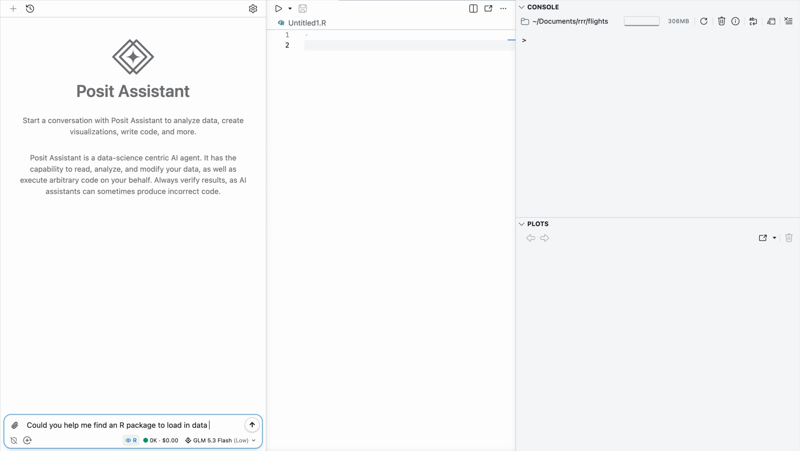
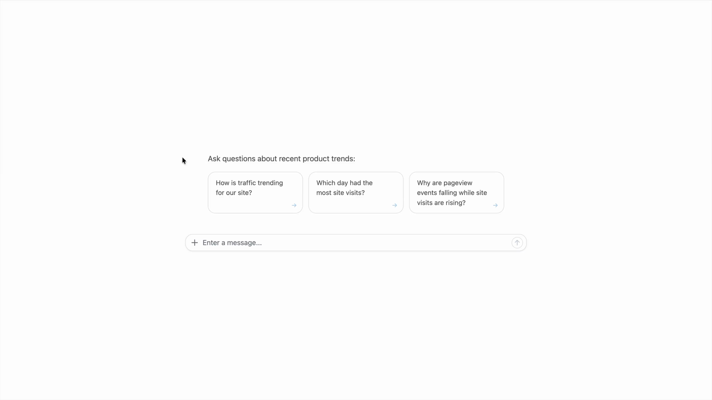

## {#title .title-slide .green-slide}

::: {.columns}

::: {.column width="68%"}
### Agents for correct, transparent, and reproducible analysis {.talk-title}

::: {.talk-meta}
**Simon Couch and Sara Altman**

posit::conf(2026)
:::
:::

::: {.column width="32%"}
<div class="circle-pair circle-pair-overlap" aria-hidden="true"><span class="circle periwinkle-circle"></span><span class="circle orange-circle"></span></div>
:::

:::

::: {.footer .title-footer}
https://pos.it/keynote
:::

## {#site-traffic-analysis .agent-story-slide .slow-tool-calls}

```{=html}
<div class="agent-window">
  <div class="agent-thread">
        <div class="chat-turn chat-turn-user">
          <div class="chat-message chat-message-user">
            how is traffic trending for our site?
          </div>
        </div>
        <div class="chat-turn chat-turn-agent tool-run fragment fade-up" data-fragment-index="0">
          <div class="chat-message chat-message-agent">
            <div class="agent-thinking"><span></span> Analyzing site traffic</div>
            <div class="tool-card" style="--tool-delay: 0s">
              <span class="tool-card-icon">⌕</span>
              <span><strong>Searching workspace</strong><small>web analytics</small></span>
              <span class="tool-progress"><i class="tool-spinner"></i><i class="tool-check">✓</i></span>
            </div>
            <div class="tool-card" style="--tool-delay: 2.25s">
              <span class="tool-card-icon">◫</span>
              <span><strong>Querying warehouse</strong><small>analytics.pageviews</small></span>
              <span class="tool-progress"><i class="tool-spinner"></i><i class="tool-check">✓</i></span>
            </div>
            <div class="tool-card" style="--tool-delay: 3.5s">
              <span class="tool-card-icon">∿</span>
              <span><strong>Calculating daily visits</strong><small>last 90 days</small></span>
              <span class="tool-progress"><i class="tool-spinner"></i><i class="tool-check">✓</i></span>
            </div>
          </div>
        </div>
        <div class="chat-turn chat-turn-agent result-turn fragment fade-up" data-fragment-index="0">
          <div class="chat-message chat-message-agent">
            <p>Daily visits are down <strong>64%</strong> over the last 90 days.</p>
            <div class="dau-chart">
              <div class="dau-chart-title"><span>Daily site visits</span><strong>−64%</strong></div>
              <svg viewBox="0 0 620 225" role="img" aria-label="Daily site visits rise unevenly, then fall sharply after a changepoint.">
                <defs>
                  <linearGradient id="dau-area" x1="0" y1="0" x2="0" y2="1">
                    <stop offset="0%" stop-color="#ee6331" stop-opacity="0.28"/>
                    <stop offset="100%" stop-color="#ee6331" stop-opacity="0.02"/>
                  </linearGradient>
                </defs>
                <g class="chart-grid">
                  <line x1="56" y1="34" x2="598" y2="34"/><line x1="56" y1="86" x2="598" y2="86"/>
                  <line x1="56" y1="138" x2="598" y2="138"/><line x1="56" y1="190" x2="598" y2="190"/>
                </g>
                <g class="chart-labels">
                  <text x="46" y="39">60k</text><text x="46" y="91">40k</text><text x="46" y="143">20k</text>
                  <text x="56" y="215">90 days ago</text><text x="324" y="215">45 days ago</text><text x="598" y="215">Today</text>
                </g>
                <path class="chart-area" d="M56,61 L69,67 L82,58 L95,60 L108,54 L121,59 L134,51 L147,55 L160,57 L173,48 L186,52 L199,45 L212,50 L225,42 L238,46 L251,39 L264,44 L277,36 L290,41 L303,34 L313,37 L319,35 L329,51 L340,57 L351,53 L362,66 L373,61 L384,72 L395,78 L406,73 L417,86 L428,82 L439,95 L450,99 L461,93 L472,108 L483,103 L494,117 L505,113 L516,126 L527,122 L538,134 L549,130 L560,140 L571,137 L582,146 L598,145 L598,190 L56,190 Z"/>
                <path class="chart-line" pathLength="1" d="M56,61 L69,67 L82,58 L95,60 L108,54 L121,59 L134,51 L147,55 L160,57 L173,48 L186,52 L199,45 L212,50 L225,42 L238,46 L251,39 L264,44 L277,36 L290,41 L303,34 L313,37 L319,35 L329,51 L340,57 L351,53 L362,66 L373,61 L384,72 L395,78 L406,73 L417,86 L428,82 L439,95 L450,99 L461,93 L472,108 L483,103 L494,117 L505,113 L516,126 L527,122 L538,134 L549,130 L560,140 L571,137 L582,146 L598,145"/>
                <circle class="chart-end" cx="598" cy="145" r="6"/>
              </svg>
            </div>
          </div>
        </div>
  </div>
</div>
```

:::notes
This morning, your VP pulled up a coding agent and asked a question. 

[yada yada this is what happen]

Now, as data people, we might have asked ourselves "How are daily visits being measured?" "What event triggers an entry in this column?" "What other possible explanations could account for this change in trend other than a genuine reversal in the traffic going to this site?" If you had dug further, you would have learned that this kind of pageview event no longer triggers on newer versions of Chrome. As users gradually update Chrome, their page visits are no longer registered in this table. Regardless, this isn't even the typical table that the data science team uses to measure site traffic anyway.

Nevertheless, you're not there. Your VP brings this chart to leadership. They decide to spend millions to reverse the trend.
:::

## {#site-traffic-recreated .agent-story-slide .slow-tool-calls}

```{=html}
<div class="agent-window month-later-window">
  <div class="agent-thread">
    <div class="chat-turn chat-turn-user">
      <div class="chat-message chat-message-user">
        could you find the site traffic chart we made a month ago?
      </div>
    </div>
    <div class="chat-turn chat-turn-agent tool-run history-tool-run fragment fade-up" data-fragment-index="0">
      <div class="chat-message chat-message-agent">
        <div class="agent-thinking"><span></span> Looking for prior analysis</div>
        <div class="tool-card" style="--tool-delay: 0s">
          <span class="tool-card-icon">⌕</span>
          <span><strong>Searching conversations</strong><small>site traffic chart</small></span>
          <span class="tool-progress"><i class="tool-spinner"></i><i class="tool-check">✓</i></span>
        </div>
        <div class="tool-card" style="--tool-delay: 1.25s">
          <span class="tool-card-icon">◫</span>
          <span><strong>Checking generated files</strong><small>temporary workspace</small></span>
          <span class="tool-progress"><i class="tool-spinner"></i><i class="tool-check">✓</i></span>
        </div>
      </div>
    </div>
    <div class="chat-turn chat-turn-agent history-missing fragment fade-up" data-fragment-index="0">
      <div class="chat-message chat-message-agent">
        I couldn’t find that conversation or any saved analysis files. Do you want me to recreate that chart for the last 90 days?
      </div>
    </div>
    <div class="chat-turn chat-turn-user fragment fade-up" data-fragment-index="1">
      <div class="chat-message chat-message-user">
        yeah
      </div>
    </div>
    <div class="chat-turn chat-turn-agent tool-run fragment fade-up" data-fragment-index="2">
      <div class="chat-message chat-message-agent">
        <div class="agent-thinking"><span></span> Analyzing site traffic</div>
        <div class="tool-card" style="--tool-delay: 0s">
          <span class="tool-card-icon">⌕</span>
          <span><strong>Searching workspace</strong><small>web analytics</small></span>
          <span class="tool-progress"><i class="tool-spinner"></i><i class="tool-check">✓</i></span>
        </div>
        <div class="tool-card" style="--tool-delay: 1.25s">
          <span class="tool-card-icon">◫</span>
          <span><strong>Querying warehouse</strong><small>analytics.sessions</small></span>
          <span class="tool-progress"><i class="tool-spinner"></i><i class="tool-check">✓</i></span>
        </div>
        <div class="tool-card" style="--tool-delay: 2.5s">
          <span class="tool-card-icon">∿</span>
          <span><strong>Calculating daily visits</strong><small>last 90 days</small></span>
          <span class="tool-progress"><i class="tool-spinner"></i><i class="tool-check">✓</i></span>
        </div>
      </div>
    </div>
    <div class="chat-turn chat-turn-agent result-turn fragment fade-up" data-fragment-index="2">
      <div class="chat-message chat-message-agent">
        <p>Daily visits increased <strong>22%</strong> over the last 90 days.</p>
        <div class="dau-chart">
          <div class="dau-chart-title"><span>Daily site visits</span><strong>+22%</strong></div>
          <svg viewBox="0 0 620 225" role="img" aria-label="Daily site visits trend unevenly upward over the last 90 days.">
            <defs>
              <linearGradient id="traffic-area-up" x1="0" y1="0" x2="0" y2="1">
                <stop offset="0%" stop-color="#23875b" stop-opacity="0.26"/>
                <stop offset="100%" stop-color="#23875b" stop-opacity="0.02"/>
              </linearGradient>
            </defs>
            <g class="chart-grid">
              <line x1="56" y1="34" x2="598" y2="34"/><line x1="56" y1="86" x2="598" y2="86"/>
              <line x1="56" y1="138" x2="598" y2="138"/><line x1="56" y1="190" x2="598" y2="190"/>
            </g>
            <g class="chart-labels">
              <text x="46" y="39">60k</text><text x="46" y="91">40k</text><text x="46" y="143">20k</text>
              <text x="56" y="215">90 days ago</text><text x="324" y="215">45 days ago</text><text x="598" y="215">Today</text>
            </g>
            <path class="chart-area" d="M56,69 L69,74 L82,66 L95,71 L108,63 L121,68 L134,70 L147,61 L160,65 L173,57 L186,64 L199,60 L212,54 L225,58 L238,62 L251,52 L264,56 L277,48 L290,55 L303,51 L316,44 L329,50 L342,47 L355,39 L368,46 L381,43 L394,49 L407,40 L420,44 L433,36 L446,43 L459,38 L472,34 L485,42 L498,37 L511,31 L524,39 L537,35 L550,29 L563,36 L576,33 L589,38 L598,41 L598,190 L56,190 Z"/>
            <path class="chart-line" pathLength="1" d="M56,69 L69,74 L82,66 L95,71 L108,63 L121,68 L134,70 L147,61 L160,65 L173,57 L186,64 L199,60 L212,54 L225,58 L238,62 L251,52 L264,56 L277,48 L290,55 L303,51 L316,44 L329,50 L342,47 L355,39 L368,46 L381,43 L394,49 L407,40 L420,44 L433,36 L446,43 L459,38 L472,34 L485,42 L498,37 L511,31 L524,39 L537,35 L550,29 L563,36 L576,33 L589,38 L598,41"/>
            <circle class="chart-end" cx="598" cy="41" r="6"/>
          </svg>
        </div>
      </div>
    </div>
  </div>
</div>
```

:::notes
A month later, leadership will ass to see the chart again. The VP will open up the same agent, but it can't find the conversation. (It was deleted after 30 days.) All of the analysis had happened in a tempfile that is long gone. 

The agent offers to make it again. This time, when the VP asks for the same plot, they see that site visits had been steadily trending upward the whole time.
:::

## {#test-set}

{.rounded}

:::notes
This is something that we've seen quite a bit internally at Posit, and also with many of the organizations we work with. It's becoming normal to vibe-analyze data.

The idea for this hypothetical came from this hilariously-titled episode of The Test Set podcast.
:::

## {#convenience-versus-correctness .quote-slide .paper-slide}

> In the battle between convenience and correctness, convenience is winning.
>
> <footer>Joe Cheng (CTO @ Posit)</footer>

::: notes
Posit's CTO recently summarized this trend like so:

It is true that AI has largely been a threat to correctness. A broader population of people can now convincingly do data analysis.

It just so happened that Joe said this a month ago, but he could have said it 6/7 years ago (ayyy) and it would still have been true.
:::

## {#conviviality-spreadsheet-error}

{.rounded .nostretch width="90%"}

:::footer
<span style="color:#ee6331;">https://www.accountingweb.co.uk/business/management-accounting/convivialitys-spreadsheet-hell-sinks-the-business</span>
:::

::: notes
In 2019, Conviviality (a beverage company) discovered they had been mistakenly reporting healthy financials for years due to a “spreadsheet arithmetic error.”

> £5.2m of that £14m came thanks to “a material error in the financial forecasts”. The error, it later admitted, was “a spreadsheet arithmetic error”.
:::

## {#protein-modeling-software-error}

{.rounded .nostretch width="80%"}

:::footer
https://www.science.org/doi/10.1126/science.314.5807.1856
:::

:::notes
Or Joe could have said it 20 years ago, when it came to light that a whole subfield of protein modeling had been distracted by a bug in in-house, closed-source software.

From 2001 to 2006, Geoffrey Chang published a series of heavy-hitting papers that reshaped his field, while other labs struggled to reproduce their findings. The software that the Chang lab used to carry out the analysis contained a bug that flipped the sign of a computation. The bug came to light when another lab solved a similar protein structure and saw that it produced a near-mirror image of Chang's. At this point, the Chang lab checked their code, found the bug, and retracted 5 papers.
:::

## {#rstudio-project-blog}

. . .

{height="700" style="display: block; margin: 0 auto;"}

:::notes
I bring these examples up to say that there have always been threats to correctness in data analysis. This is why Posit was founded; correctness in high-stakes data analysis has always been our thing. But our stance is not "you need to forgo convenience in favor of correctess."

I was doing some research for this talk when I came across this old weblog...
:::

:::footer
rstudioblog.wordpress.com/2011/02/27/about-the-rstudio-project/
:::

## {#trustworthy-and-intuitive .quote-slide .compact-quote .paper-slide}

> Our goal is to develop a powerful tool that supports [trustworthy, high quality analysis]{.accent}.
>
> <br>
>
> At the same time, we want RStudio to be as [straightforward and intuitive]{.accent} as possible.
>
> <footer>JJ Allaire (Founder @ Posit), 2011</footer>

:::footer
https://rstudioblog.wordpress.com/2011/02/28/rstudio-new-open-source-ide-for-r/
:::

:::notes
He's saying "it can be correct _and_ convenient."

What if our stance was the same with AI? In other words, can we build data analysis agents that are both correct and convenient to use?
:::


# {#correct-and-convenient .correct-convenient-slide .paper-slide}

<div class="cc-wrap">
  <div class="circle-pair circle-pair-animated" aria-hidden="true"><span class="circle periwinkle-circle"></span><span class="circle orange-circle"></span><span class="fragment circle-overlap-trigger" data-fragment-index="0"></span></div>
  <div class="cc-text fragment fade-up" data-fragment-index="1">Correct and convenient</div>
</div>


# {#ai-correctness-in-2025 .paper-slide}

::: notes
this pull between correctness and convenience has weighed on all of our minds in this new age of llms

and it became especially relevant last year in 2025
for us and for many of you I imagine 2025 was the year AI got very very convenient and we needed to think seriously about correctness 

and we were so worried 
:::

## {#databot-flotation-device .split-image-slide .split-40 .split-contain-white background-image="figures/databot-flotation-blog-cropped.png"}

::: {.columns}

::: {.column}
### August 2025 {.split-title}
:::

::: {.column role="img" aria-label="Illustration of a databot mascot wearing a flotation device"}
:::

:::

::: {.footer .footer-image-side}
posit.co/blog/databot-is-not-a-flotation-device
:::

::: notes
so worried that when we released our new sota coding agent in 2025, we did so under what was essentially a warning label

this is an image from a blog post joe and I wrote to accompany the release of databot, which was an exploratory data analysis agent that lived in positron

and this post was actually one of the first things I worked when I joined the AI team, and it gave me the opportunity to do one of the things that I think I do best: be a pessimist 
:::

# {#flotation-device-photo background-image="figures/getty-images-YqJdF4TIxG0-unsplash.jpg" background-size="cover" background-position="center"}

:::footer
Getty Images. Thank you Margaret Biffar and Isabella Velásquez!
:::

# {#databot .paper-slide}

{style="display: block; margin: 0 auto;"}

::: notes
because we were all so excited about databot, but also so worried about people trusting its answers when it was wrong

that we wrote an entire blog post explaining the ways in which it might fail
:::

# {#exciting-and-dangerous .quote-slide .compact-quote .paper-slide}

> In my 30-year career writing software professionally, Databot is both the [most exciting software]{.accent} I've worked on, and also the\
> [most dangerous]{.accent}.
>
> <footer>Joe Cheng, Posit CTO</footer>

::: notes
and if you were here at conf last year, you might remember Joe's keynote where said somethign a bit like this
:::


# {#why-build-ai .paper-slide}

::: notes
and given that I think at this point there might be a question on your mind, which
I think is fair to ask and I think we all have asked ourselves in the past few years
:::

# {#why-are-we-doing-this .statement-slide .paper-slide}

::: {.statement}
Why are we doing this?!
:::

::: notes
if AI is this agent of chaos that we are so worried, why involve ourselves at all

and there are many answers, one of which is that things change quickly. something you might have worried abotu yesterday is no longer true today

and so in light of that its worth briefly checking in on how we see llms for data analysis right now in september 2026
:::

## The models got better {#models-got-better .beat-slide}

```{r}
#| include: false
library(ggplot2)
library(dplyr)
library(forcats)
library(ggforce)
library(scales)

original_results_env <- new.env()
load("data/bluffbench-original-results.rda", envir = original_results_env)
bluffbench_original_results <- original_results_env$bluff_results

latest_results_env <- new.env()
load("data/bluffbench-latest-results.rda", envir = latest_results_env)
bluffbench_latest_results <- latest_results_env$bluff_results

bluff2_results_env <- new.env()
load("data/bluffbench2-latest-results.rda", envir = bluff2_results_env)
bluff2_latest_results <- bluff2_results_env$bluff2_results

bluffbench_results_theme <-
  theme_minimal(base_size = 22) +
  theme(
    plot.background = element_rect(fill = "#f5f2ec", color = NA),
    panel.background = element_rect(fill = "#f5f2ec", color = NA),
    legend.background = element_rect(fill = "#f5f2ec", color = NA),
    legend.key = element_rect(fill = "#f5f2ec", color = NA),
    panel.grid.minor = element_blank(),
    panel.grid.major = element_line(color = "#dedbd5"),
    text = element_text(color = "#24437b"),
    axis.text = element_text(color = "#24437b"),
    strip.background = element_blank(),
    strip.text = element_text(color = "#24437b", face = "bold"),
    plot.title.position = "plot"
  )

bluff2_summary <-
  bluff2_latest_results |>
  summarize(
    score = (sum(score == "C") + (sum(score == "P") * .5)) / n(),
    .by = model
  ) |>
  mutate(model = gsub(" (medium)", "", model, fixed = TRUE))
```


## {#bluffbench-counterintuitive-plot .paper-slide}

::: {.plot-slide-content .fragment data-fragment-index="0"}

```{r}
#| echo: false
#| fig-align: center
#| fig-alt: "A scatterplot of price against carat. The points form a clear negative association, with price generally falling as carat rises."
#| fig-width: 12
#| fig-height: 6
#| fig-bg: "#f5f2ec"
#| out-width: "92%"
bluffbench_diamonds <- ggplot2::diamonds |>
  mutate(carat = max(carat) - carat)

ggplot(bluffbench_diamonds, aes(x = carat, y = price)) +
  geom_point(size = 3, alpha = 0.2) +
  theme(
    plot.background = element_rect(fill = "#f5f2ec", color = NA),
    axis.title = element_text(size = 30, color = "#24437b"),
    axis.text = element_text(size = 22, color = "#24437b")
  )
```

:::

<div class="fragment plot-overlay-caption" data-fragment-index="1">Can models interpret plots that contradict their expectations?</div>

::: notes
around a year ago we did an experiment
we wanted to know how well models interpret plots
we showed them plots like this one of well known datasets
if youre thinking uh thats not right. you are correct. 

this is what we wanted to know: would models correctly interpret plots that contradicted their expectations?
:::

## November 2025 {#bluffbench-november-2025 .paper-slide}

::: {.plot-slide-content}

```{r}
#| echo: false
#| fig-align: center
#| fig-alt: "A horizontal stacked bar chart titled 'Models often report what they expect to see, not what's plotted.' GPT-5, Gemini Pro 2.5, and Claude Sonnet 4.5 are mostly incorrect."
#| fig-width: 12
#| fig-height: 7.5
#| fig-bg: "#f5f2ec"
#| out-width: "70%"
bluffbench_original_results |>
  filter(type == "mocked") |>
  mutate(score = fct_recode(score, "Correct" = "C", "Incorrect" = "I")) |>
  ggplot(aes(y = model, fill = score)) +
  geom_bar(position = "fill") +
  scale_fill_manual(
    name = NULL,
    breaks = c("Correct", "Incorrect"),
    values = c("Correct" = "#67a9cf", "Incorrect" = "#ef8a62")
  ) +
  scale_x_continuous(labels = scales::percent) +
  labs(
    title = "Models often report what they expect to see, not what's plotted",
    subtitle = "With well-known datasets",
    x = NULL,
    y = NULL
  ) +
  bluffbench_results_theme +
  theme(
    plot.title = element_text(size = 26, face = "bold"),
    plot.subtitle = element_text(size = 18),
    axis.text.x = element_text(size = 18),
    axis.text.y = element_text(size = 20),
    legend.position = "top",
    legend.justification = "left",
    legend.text = element_text(size = 18)
  )
```

:::

:::footer
posit-dev.github.io/bluffbench
:::

::: notes
We tried a range of interventions to improve these scores, but none moved them
much. Even when a model noticed during its reasoning that the association did
not look as expected, it often still reported the expected relationship.
:::

## September 2026 {#bluffbench-september-2026 .paper-slide}

::: {.plot-slide-content}

```{r}
#| echo: false
#| fig-align: center
#| fig-alt: "A faceted horizontal stacked bar chart of percent correct across recent models, split into thinking and no-thinking groups. Thinking models perform better, while most models still give many incorrect answers."
#| fig-width: 12
#| fig-height: 7.5
#| fig-bg: "#f5f2ec"
#| out-width: "70%"
bluffbench_latest_results |>
  filter(
    type == "mocked",
    release_date >= as.Date("2026-04-01")
  ) |>
  mutate(
    score = fct_recode(score, "Correct" = "C", "Incorrect" = "I"),
    pct_correct = ave(score == "Correct", model, FUN = mean),
    model = gsub(" \\((medium|non-thinking)\\)$", "", model),
    model = reorder(model, pct_correct),
    thinking = factor(
      ifelse(thinking, "Thinking", "No thinking"),
      levels = c("Thinking", "No thinking")
    )
  ) |>
  filter(thinking == "Thinking") |>
  ggplot(aes(y = model, fill = score)) +
  geom_bar(position = "fill") +
  scale_fill_manual(
    name = NULL,
    values = c("Correct" = "#67a9cf", "Incorrect" = "#ef8a62")
  ) +
  scale_x_continuous(labels = scales::percent) +
  labs(
    title = "Models got better at interpreting counterintuitive plots",
    x = "Percent correct",
    y = NULL
  ) +
  bluffbench_results_theme +
  theme(
    plot.title = element_text(size = 26, face = "bold"),
    axis.text.x = element_text(size = 18),
    axis.text.y = element_text(size = 14),
    axis.title.x = element_text(size = 22),
    strip.text = element_text(size = 22, hjust = 0),
    legend.position = "none",
    plot.margin = margin(5.5, 5.5, 15, 5.5)
  )
```

:::

:::footer
posit-dev.github.io/bluffbench
:::

## Correct analysis still takes more than a good model. {#frontier-model-not-enough .beat-slide}

## {#bluffbench2-data-artifact .paper-slide}

::: {.plot-slide-content}

```{r}
#| echo: false
#| fig-align: center
#| fig-alt: "A scatterplot of sleep hours against stress score with a negative trend. A subset of points falls exactly along a straight line, suggesting a data-quality artifact."
#| fig-width: 12
#| fig-height: 6
#| fig-bg: "#f5f2ec"
#| out-width: "92%"
set.seed(617)

n <- 150
n_imp <- 35
sleep_hours <- round(runif(n, 4, 10), 1)
stress_score <- round(
  pmin(pmax(95 - 7.5 * sleep_hours + rnorm(n, 0, 8), 5), 95),
  1
)

imp_sleep <- round(runif(n_imp, 4.5, 9.5), 1)
imp_stress <- round(95 - 7.5 * imp_sleep, 1)

wellbeing_data <- data.frame(
  sleep_hours = c(sleep_hours, imp_sleep),
  stress_score = c(stress_score, imp_stress)
)

ggplot(wellbeing_data, aes(x = sleep_hours, y = stress_score)) +
  geom_point(alpha = 0.8, size = 3) +
  labs(x = "sleep (hours)", y = "stress score") +
  theme(
    plot.background = element_rect(fill = "#f5f2ec", color = NA),
    axis.title = element_text(size = 30, color = "#24437b"),
    axis.text = element_text(size = 22, color = "#24437b")
  )
```

:::

:::footer
github.com/posit-dev/bluffbench2
:::

::: notes
bluffbench2 tests whether models notice subtle data quality issues in
visualizations.

take a look at this plot. what do you notice?

one thing that flags my attention is these points through the middle of the cloud that fall exactly on a straight line. this is something i might want to dig into further and make sure nothing strange was happening in the underlying data.

we wanted to see if models would be able to pick up on this kind of subtle visual artifact
:::

## {#bluffbench2-results .paper-slide}

::: {.plot-slide-content}

```{r}
#| echo: false
#| fig-align: center
#| fig-alt: "A horizontal bar chart of bluffbench2 scores by model. Every model scores below 50 percent, showing that frontier models still struggle to notice subtle data-quality issues."
#| fig-width: 12
#| fig-height: 7
#| fig-bg: "#f5f2ec"
#| out-width: "78%"
bluff2_summary |>
  mutate(model = fct_reorder(model, score)) |>
  ggplot() +
  aes(x = score, y = model) +
  geom_col(fill = "#2c84e1") +
  scale_x_continuous(labels = label_percent(), limits = c(0, 1)) +
  labs(
    x = "Score",
    y = NULL,
    title = "Frontier models still struggle to notice subtle data quality issues"
  ) +
  bluffbench_results_theme +
  theme(
    plot.title = element_text(size = 26, face = "bold"),
    axis.text.y = element_text(size = 22),
    axis.text.x = element_text(size = 20)
  )
```

:::

:::footer
github.com/posit-dev/bluffbench2
:::

::: notes
even frontier models don't do very well
:::

# {#context-outside-the-data .statement-slide .paper-slide}

::: {.statement}
Data analysis depends on [context]{.accent} that is not in the data.
:::

::: notes
but there is a second problem: data analysis depends on context that is not in the data

documentation, etc all shape whether an analysis is correct

a human expert often holds that context
:::

## {#transition .paper-slide}

## New ways to understand data. {#llms-and-data-exploration .beat-slide}

::: notes
but for me and I think many of us at posit, much of the answer has to do with a sense of curiosity and exploration
:::

## {#exploration}

## {#mission-ocean background-image="figures/mission-ocean.jpg" background-size="cover" background-position="center"}

::: notes
for myself and i imagine for many of you, a sense of exploration and curiosity are what got us here in the first place. 

Maybe it was curiosity about a scientific field that led you to data analysis, or curiosity about the tools themselves, how computers work, or statistics. 

But without the right tools, data can be impenetrable. As an undergraduate with knowledge of statistics and some R as an undergraduate, I felt like I was looking at an ocean from above.You know there is an incredible amount there, but you cannot see it. 

learning the tidyverse, and data science...these tools gave me a way to investigate any topic and learn about the world.
:::

## {#below-the-surface .split-image-slide background-image="figures/oceanimagebank-rays.jpg"}

::: {.columns}

::: {.column}
### The right tools let us see below the surface. {.split-title}
:::

::: {.column role="img" aria-label="A school of rays swimming below the ocean surface"}
:::

:::

<div class="image-credit">Photo: Lars von Ritter Zahony / Ocean Image Bank</div>

::: notes
the right tools let us see below the surface
The tools enable the curiosity. 
:::

# {#ai-as-continuation .statement-slide .paper-slide}

::: {.statement}
AI is a [continuation]{.accent} of our work to find [new ways to explore data]{.accent}.
:::

::: notes
But AI is also a continuation of work that Posit and this community have always done. We are curious about new tools: how they work, what they make possible, and we turn drive into tools that open up new worlds of analysis. 

all three point in the same direction: we are going to keep going down the LLM path. so then the question becomes... 
:::

# {#correct-ai-analysis .header-slide .blue-slide}

::: {.columns}

::: {.column .header-text width="64%"}
How do we make AI-involved analysis correct?
:::

::: {.column width="36%"}
{.header-image fig-alt="Orange shield"}
:::

:::

## {#human-in-the-loop-intro}

## {#slap-a-human-on-it .paper-slide}

::: {style="display: flex; height: 100%; flex-direction: column; align-items: center; justify-content: center; gap: 0.75rem;"}
{style="width: auto; max-height: 600px; margin: 0; border-radius: 0.75rem;"}

<div class="fragment" style="min-height: 1.15em; margin: 0; font-size: 1em; line-height: 1.15;">*the <strong>slap a human on it</strong> approach</div>
:::

::: notes
this sounds so nice! the human is there to prevent mistakes and all will be good. so we should just apply this anywhere we see a problem.

I like to call this simplistic division of labor the "slap a human on it" approach.

there's only one problem: this simple view is not how these systems work.

you can't assume that just because a human is present and technically "in the loop," you've solved the issue of correctness by asking them to verify something.
:::

# {#human-in-the-loop .paper-slide .diagram-slide}



::: notes
- Here’s a common thought about AI
  - It’s untrustworthy, but useful.
  - To make it trustworthy, we need people to verify the output from or supervise agents.

it is an intuitively appealing division of labor. the agent does what it's good at, the human provides the judgment to keep it from going off the rails.
:::

# {#user-responsibility background-image="figures/databot-flotation-beach.png" background-size="cover" background-position="center"}

::: {.fragment style="position: absolute; top: 43%; left: 2%; width: 45%; margin: 0; padding: 0.75rem 1rem; background: #f5f2ec; color: #24437b; box-shadow: 0 0.5rem 1.25rem rgb(0 0 0 / 25%); font-size: 0.72em; font-weight: 700; text-align: left;"}
"Databot, and LLMs in general, aren’t at a point where you can abdicate responsibility or suspend skepticism when working with data. ...
These skills help you <span style="color:#dd5d7b;">catch errors, interpret results in context, and avoid being misled by confident but incorrect claims."</span>
:::

:::footer
<span style="color:#fff1c9;">posit.co/blog/databot-is-not-a-flotation-device</span>
:::

::: notes
we wrote a whole article about the dangers of Databot and why users needed to remain skeptical and apply their expertise

All of that is still true. I stand by it. It's inspirational! I would love to avoid being misled by confident but incorrect claims.

but notice that this puts the responsibility for correctness on the user: be there, remain vigilant, and apply your expertise

underneath it was one implicit strategy: stay vigilant and read the code
:::

# {#human-ai-evidence .paper-slide .hitl-evidence-slide}

::: {.hitl-evidence-heading}
Adding a human [does not guarantee]{.accent} a better result.
:::

::: {.hitl-evidence-points .incremental}
- Human-AI combination often underperforms one or the other. 
- Approval fatigue.
- Trust, timing, cognitive load, social cues, and information design all shape decisions.
:::

::: {.footer .hitl-footer}
Vaccaro et al. (2024); Parasuraman and Manzey (2010); Anthropic (2026)
:::

::: notes
a 2024 meta-analysis looked at 106 experimental studies that compared humans alone, AI alone, and human-AI teams

on average, the combination performed worse than the better of the human or AI alone. decision tasks showed particular losses

this does not mean every human-AI team is worse. it means that adding a human does not automatically produce a better system

human judgment does not stay fixed when we put someone into an agent system

automation bias is one example: in soem situations, people can follow an automated recommendation even when it is wrong

approval fatigue can be a big issue
think about your own coding agent. when it asks you to approve a command, how often do you carefully read it, and how often do you just hit accept?

trust, timing, cognitive load, social cues, the interface, and the amount of information all affect how someone decides whether code or an action is correct or safe

full citations, in case anyone asks:
- Vaccaro, M., Almaatouq, M., & Malone, T. W. (2024). "When combinations of humans and AI are useful: A systematic review and meta-analysis." Nature Human Behaviour, 8, 2296–2309.
- Parasuraman, R., & Manzey, D. H. (2010). "Complacency and bias in human use of automation: An attentional integration." Human Factors, 52(3), 381–410.
- Hughes, J. & Anthropic (2026). "How we built Claude Code auto mode: a safer way to skip permissions." anthropic.com/engineering/claude-code-auto-mode
:::

# {#people-are-not-fixed .statement-slide .paper-slide}

::: {.statement}
People are [not fixed safety components.]{.accent}
:::

::: notes
because people are not fixed safety components 
we can't just slot them in whenever we are worried an agent system might be wrong
:::

# {#design-the-entire-system .beat-slide}

[How do we design the entire system to produce correct work?]{.fragment}

::: notes
the question is how we design the interaction and the entire system so that human expertise can actually support correctness
:::

# {#agent-correctness-goals .statement-slide .paper-slide}

::: {.bullet-replace}

::: {.statement .regular-weight .replace-parents .fragment .fade-out data-fragment-index="0"}
Build trust and correctness into the agent itself<br><br>
Consider how the agent will interact with the user and support their expertise
:::

::: {.statement .regular-weight .replace-subs .fragment data-fragment-index="0"}
Help the agent be correct<br><br>
Make it less bad when the agent is wrong
:::

:::

::: notes 

In other words: help the agent be correct, and make it less bad when it's wrong.

so for the rest of our time today instead as we go through what we've been working on we are going to focus on these two goals
:::

## {#posit-assistant .blue-slide .posit-assistant-blue-slide}

{.rounded .nostretch height="650"}

:::notes
Our flagship agent is Posit Assistant. Posit Assistant is a coding and data science agent. It's available in RStudio, Positron, and the terminal. When it's running inside of your IDE, it works inside of your active R and Python session. You can use whatever model from whatever provider you want with it.
:::

:::footer
assistant.posit.co
:::

## {#flight-delay-demo}

:::notes
In thinking through how to demo out Posit Assistant, I thought about how Sara described her first moments of really getting the hang of data science tools as like seeing below the surface. I think many of us might have had a moment like this at some point, when we began to understand how powerful data science and statistics are for answering questions about the world.

The first time I felt this way, I had been asked to use R to understand what affects flight delays. I had to load in some data and then write dplyr and ggplot to see if I could make any decisions that would give me better chances of my flight leaving on time. 

In demoing Posit Assistant, I thought I might revisit that moment with you. 
:::

## {#posit-assistant-web-fetch-start}

{.rounded .nostretch width="100%"}

## {#posit-assistant-web-fetch}

<video class="rounded click-to-toggle" width="100%" preload="auto" data-autoplay tabindex="0" aria-label="Click to play or pause">
  <source src="figures/01-pa-demo-webfetch-a.mp4">
</video>

:::notes
I'm in Positron, with Posit Assistant pulled up on the left hand side and a live R session. I'll start off by asking the agent about R packages that could help me grab data on flights.

...

It can do normal coding agent stuff
:::

## {#posit-assistant-web-fetch-b}

<video class="rounded click-to-toggle" width="100%" preload="auto" data-autoplay tabindex="0" aria-label="Click to play or pause">
  <source src="figures/01-pa-demo-webfetch-b.mp4">
</video>

## {#posit-assistant-docs}

<video class="rounded click-to-toggle" width="100%" preload="auto" data-autoplay tabindex="0" aria-label="Click to play or pause">
  <source src="figures/02-pa-demo-docs-a.mp4">
</video>

:::notes
It can read documentation (in the same way that you would, too)

Also, note that it preferred to keep data in the file system
:::

## {#posit-assistant-docs-b}

<video class="rounded click-to-toggle" width="100%" preload="auto" data-autoplay tabindex="0" aria-label="Click to play or pause">
  <source src="figures/02-pa-demo-docs-b.mp4">
</video>

## {#posit-assistant-clean-data}

<video class="rounded click-to-toggle" width="100%" preload="auto" data-autoplay tabindex="0" aria-label="Click to play or pause">
  <source src="figures/03-pa-demo-clean-data-a.mp4">
</video>

:::notes
* Cleaning mode: we felt that most coding agents had a superficial relationship with data quality
* It pays attention to missing data, outliers, etc
* Cleaning script is persisted
:::

## {#posit-assistant-clean-data-b}

<video class="rounded click-to-toggle" width="100%" preload="auto" data-autoplay tabindex="0" aria-label="Click to play or pause">
  <source src="figures/03-pa-demo-clean-data-b.mp4">
</video>

## {#posit-assistant-clean-data-c}

<video class="rounded click-to-toggle" width="100%" preload="auto" data-autoplay tabindex="0" aria-label="Click to play or pause">
  <source src="figures/03-pa-demo-clean-data-c.mp4">
</video>

## {#posit-assistant-clean-data-d}

<video class="rounded click-to-toggle" width="100%" preload="auto" data-autoplay tabindex="0" aria-label="Click to play or pause">
  <source src="figures/03-pa-demo-clean-data-d.mp4">
</video>

## {#posit-assistant-carriers}

<video class="rounded click-to-toggle" width="100%" preload="auto" data-autoplay tabindex="0" aria-label="Click to play or pause">
  <source src="figures/05-pa-demo-carriers-a.mp4">
</video>

:::notes
You can see plots

The agent shows restraint in interpretation; is concerned about sample sizes before interpreting this anomoly in the plot
:::

## {#posit-assistant-carriers-b}

<video class="rounded click-to-toggle" width="100%" preload="auto" data-autoplay tabindex="0" aria-label="Click to play or pause">
  <source src="figures/05-pa-demo-carriers-b.mp4">
</video>

## {#posit-assistant-carriers-c}

<video class="rounded click-to-toggle" width="100%" preload="auto" data-autoplay tabindex="0" aria-label="Click to play or pause">
  <source src="figures/05-pa-demo-carriers-c.mp4">
</video>

## {#posit-assistant-report}

<video class="rounded click-to-toggle" width="100%" preload="auto" tabindex="0" aria-label="Click to play or pause">
  <source src="figures/06-pa-demo-report.mp4">
</video>

:::notes
Slash commands (has a bunch of specialized skills) + can write quarto reports
:::

## {#posit-assistant-model-cost}

<video class="rounded click-to-toggle" width="100%" preload="auto" tabindex="0" aria-label="Click to play or pause">
  <source src="figures/08-pa-demo-model-cost.mp4">
</video>

:::notes
Now, this is the end of my demo of Posit Assistant. I do have one more thing I want to call out, though.

The whole conversation was 5 cents. Part of our mission is providing the best tools to folks regardless of their economic means, and we remain committed to that. Totally free usage is not possible—AI inference is quite expensive—but Posit Assistant is token efficient, and we've worked hard to serve incredibly cheap and capable open-weights models with strong privacy guarantees for people that use our Posit AI Pass subscription. Per token, this model, GLM 5.3 Flash, is less than a thirtieth of the price of Claude Opus 5, and is served under Zero Data Retention.
:::


# {#posit-assistant-correctness .statement-slide .paper-slide}

::: {.statement .regular-weight}
Help the agent be correct [**by encouraging sound statistics and reproducibility practices**]{.fragment}<br><br> 
Make it less bad when the agent is wrong [**by making good use of your expertise and sharing an R/Python environment**]{.fragment}
:::

:::notes
Let's revisit those lessons learned on agent-building from Sara. She said we ought to Help the agent be correct, and make it less bad when the agent is wrong.

Much of helping the model not be wrong is by asking nicely :) We tell it to approach data analysis with an openness to uncertainty, we tell it work in persistent files, we tell it to take data cleanliness seriously.

Various elements of Posit Assistant help you and the agent have a richer collaboration. Data cleaning mode loops you in on important decisions that affect interpretation. We show you plots because our bluffbench evaluations show we can't trust the models to interpret models well. We place you and the agent in the same computational environment so that, when things go wrong, you can quickly get on the same page and see eye-to-eye.

That said, what about people that don't have data expertise and don't know how to write R or Python code?
:::

# {.paper-slide}

# But what if the user is not a data scientist? {#non-data-scientist .blue-slide}

::: notes
The VP does not have data science expertise and does not know how to use R and Python. Posit Assistant does not serve them. What can we do for the non data scientist users?
:::

## {#vp-site-traffic-reminder}

```{=html}
<div class="agent-window vp-reminder-window">
  <div class="agent-thread">
    <div class="chat-turn chat-turn-user">
      <div class="chat-message chat-message-user">
        how is traffic trending for our site?
      </div>
    </div>
    <div class="chat-turn chat-turn-agent result-turn">
      <div class="chat-message chat-message-agent">
        <p>Daily visits are down <strong>64%</strong> over the last 90 days.</p>
        <div class="dau-chart">
          <div class="dau-chart-title"><span>Daily site visits</span><strong>−64%</strong></div>
          <svg viewBox="0 0 620 225" role="img" aria-label="Daily site visits rise unevenly, then fall sharply after a changepoint.">
            <defs>
              <linearGradient id="dau-area-reminder" x1="0" y1="0" x2="0" y2="1">
                <stop offset="0%" stop-color="#ee6331" stop-opacity="0.28"/>
                <stop offset="100%" stop-color="#ee6331" stop-opacity="0.02"/>
              </linearGradient>
            </defs>
            <g class="chart-grid">
              <line x1="56" y1="34" x2="598" y2="34"/><line x1="56" y1="86" x2="598" y2="86"/>
              <line x1="56" y1="138" x2="598" y2="138"/><line x1="56" y1="190" x2="598" y2="190"/>
            </g>
            <g class="chart-labels">
              <text x="46" y="39">60k</text><text x="46" y="91">40k</text><text x="46" y="143">20k</text>
              <text x="56" y="215">90 days ago</text><text x="324" y="215">45 days ago</text><text x="598" y="215">Today</text>
            </g>
            <path class="chart-area" d="M56,61 L69,67 L82,58 L95,60 L108,54 L121,59 L134,51 L147,55 L160,57 L173,48 L186,52 L199,45 L212,50 L225,42 L238,46 L251,39 L264,44 L277,36 L290,41 L303,34 L313,37 L319,35 L329,51 L340,57 L351,53 L362,66 L373,61 L384,72 L395,78 L406,73 L417,86 L428,82 L439,95 L450,99 L461,93 L472,108 L483,103 L494,117 L505,113 L516,126 L527,122 L538,134 L549,130 L560,140 L571,137 L582,146 L598,145 L598,190 L56,190 Z"/>
            <path class="chart-line" pathLength="1" d="M56,61 L69,67 L82,58 L95,60 L108,54 L121,59 L134,51 L147,55 L160,57 L173,48 L186,52 L199,45 L212,50 L225,42 L238,46 L251,39 L264,44 L277,36 L290,41 L303,34 L313,37 L319,35 L329,51 L340,57 L351,53 L362,66 L373,61 L384,72 L395,78 L406,73 L417,86 L428,82 L439,95 L450,99 L461,93 L472,108 L483,103 L494,117 L505,113 L516,126 L527,122 L538,134 L549,130 L560,140 L571,137 L582,146 L598,145"/>
            <circle class="chart-end" cx="598" cy="145" r="6"/>
          </svg>
        </div>
      </div>
    </div>
  </div>
</div>
```

::: notes
I want to take a step back and revisit this conversation with the VP.

In the same way that convenience and correctness can't be at battle, you can't be at battle with your VP.

The VP had good intentions. They were driven by that same sense of curiosity and exploration that we are. Like we would, they reached for the tool that was accessible to them. 

Unfortunately, the answer they got was wrong.

I mentioned earlier that this isn't the table that the data scientists usually use to measure site traffic. The data scientists calculate that metric against a different table, and the code that they use to do lives in a semantic view in their database.
:::

# [_Trusted_ code]{#trusted-code style="color: #ee6331; font-size: 1.4em;"}

::: notes
This semantic view is an example of what we'll call _trusted_ code
It's code that has been vetted and maintained by the data team

They also might have trusted code in

* Shiny apps
* R and Python packages
* Quarto documents

Instead of the model writing code afresh every time it's answering a question, what if it could discover and use this trusted code?

This is one of the core ideas behind a new open source package that we're excited to share with you all today. It's called commons.
:::

# {#commons .commons-intro-slide}

{.commons-intro-logo .nostretch fig-alt="Commons logo"}

:::footer
https://pos.it/commons
:::

::: notes
commons helps data scientists build trustworthy data agents for their collaborators.

It's an open source R and Python package built on `ellmer` / `chatlas` and `shinychat`. You can use it with whatever model from whatever provider you want.
:::

## {#commons-trusted-calculation-start}

{.rounded .nostretch width="100%"}

## {#commons-trusted-calculation}

<video class="rounded click-to-toggle" width="100%" preload="auto" data-autoplay tabindex="0" aria-label="Click to play or pause">
  <source src="figures/commons-01-traffic-trend-a.mp4">
</video>

::: notes
let's see how the VP's analysis would work with a commons agent

The first thing the agent does it search for a trusted calculation. Here it
finds and runs the data scientist's site traffic calculation

the answer is marked as verified to signify that it used vetted code
:::

## {#commons-trusted-calculation-b}

<video class="rounded click-to-toggle" width="100%" preload="auto" data-autoplay tabindex="0" aria-label="Click to play or pause">
  <source src="figures/commons-01-traffic-trend-b.mp4">
</video>

## {#commons-trusted-calculation-c}

<video class="rounded click-to-toggle" width="100%" preload="auto" data-autoplay tabindex="0" aria-label="Click to play or pause">
  <source src="figures/commons-01-traffic-trend-c.mp4">
</video>

## {#commons-trusted-calculation-d}

<video class="rounded click-to-toggle" width="100%" preload="auto" data-autoplay tabindex="0" aria-label="Click to play or pause">
  <source src="figures/commons-01-traffic-trend-d.mp4">
</video>

## {#commons-context-citations}

<video class="rounded click-to-toggle" width="100%" preload="auto" data-autoplay tabindex="0" aria-label="Click to play or pause">
  <source src="figures/commons-02-page-views-a.mp4">
</video>

::: notes
However, its unlikely that this trusted code will cover all questions a user might have.
For these situations, the agent can write custom r, python, or sql.

First, the agent will look through additional context in the form of data dictionaries, markdown files, and, if you have them, existing context layers from Databricks and Snowflake.

Then, it will write whatever code it needs to to find an answer.

Finally, when it presents an answer, it can provides a citation to that context. That citation will be deterministically checked against trusted context that has appeared so far in the conversation—if it matches, this citation tag will be shown.

:::

## {#commons-context-citations-b}

<video class="rounded click-to-toggle" width="100%" preload="auto" data-autoplay tabindex="0" aria-label="Click to play or pause">
  <source src="figures/commons-02-page-views-b.mp4">
</video>

## {#commons-lower-trust-answer}

<video class="rounded click-to-toggle" width="100%" preload="auto" data-autoplay tabindex="0" aria-label="Click to play or pause">
  <source src="figures/commons-03-most-visits-a.mp4">
</video>

::: notes
There's one more possible path, which is that the model cannot find trusted context to justify its approach. In this case, we mark the answer with this little yellow tag, which lets the user know that this answer should be considered less trusted.

This is how we've chosen to balance convenience and correctness. The tool has to feel convenient enough that the user actually wants to reach for it. Basically, it needs to feel like a normal chat. In the situation where we suspect the correctness is similar to a normal coding agent, we signal to the user that they ought to be more skeptical of this answer.
:::

## {#commons-lower-trust-answer-b}

<video class="rounded click-to-toggle" width="100%" preload="auto" data-autoplay tabindex="0" aria-label="Click to play or pause">
  <source src="figures/commons-03-most-visits-b.mp4">
</video>

## {#commons-trust-flow .trust-flow-slide .paper-slide}

<br>

```{=html}
<div class="trust-flow" role="img" aria-label="Commons searches trusted calculations, then marks answers based on whether they use a trusted calculation or a lower-trust custom path.">
  <div class="trust-tool trust-search">Search trusted calculations</div>
  <div class="trust-route-labels" aria-hidden="true">
    <span><span>Find one</span><span class="trust-decision-arrow">↓</span></span>
    <span><span>Don’t find one</span><span class="trust-decision-arrow">↓</span></span>
  </div>
  <div class="trust-branches">
    <div class="trust-branch trust-branch-high">
      <div class="trust-tool">Run trusted calculation</div>
      <span class="trust-down-arrow" aria-hidden="true">↓</span>
      <div class="trust-marker">
        
      </div>
    </div>
    <div class="trust-branch trust-branch-lower">
      <div class="trust-tool">Search context</div>
      <span class="trust-down-arrow" aria-hidden="true">↓</span>
      <div class="trust-tool">Write SQL/R/Python</div>
      <div class="trust-citation-routes" aria-hidden="true">
        <span><span>Cite</span><span class="trust-decision-arrow">↓</span></span>
        <span><span>Don’t cite</span><span class="trust-decision-arrow">↓</span></span>
      </div>
      <div class="trust-lower-outcomes">
        <div class="trust-marker">
          
        </div>
        <div class="trust-marker">
          
        </div>
      </div>
    </div>
  </div>
</div>
```

::: notes
Commons records which tools produced the answer. Trust is based on that
execution path, not on the model's confidence in its own answer. trust is deterministic

The citation itself is checked against trusted context. A custom answer is not
promoted merely because the model says it used a trusted source.
:::

## {#commons-lifecycle .lifecycle-slide .paper-slide}

::: {.lifecycle-cards}
::: {.lifecycle-card .fragment .fade-up}
### Build

You construct the agent by hooking it up to trusted code.
:::

::: {.lifecycle-card .fragment .fade-up}
### Deploy

Your colleagues use the agent deployed on Connect.
:::

::: {.lifecycle-card .fragment .fade-up}
### Improve

You review the agent's behavior, adding trusted code to cover common use cases.
:::
:::

::: notes
So far, we've only focused on the experience of the VP. I talked about how this was a tool for data scientists, so let's take a step and see what it looks like from yall's perspective.

Remember when Sara showed you the simple loop? Working with commons is more like three loops.

1. build: encode trusted calculations and context
  After installing the package, you point the commons agent at all of your trusted code. Shiny apps, R and Python libraries, Quarto docs, or existing semantic layers in Snowflake and Databricks
  Notably, you are not defining system prompts or tool definitions. commons ships with its own harness.
2. deploy: agent answers through the trusted or custom path
  Apps deploy to Connect like any Shiny app 
  The agent runs R and Python code in a sandbox so that it can be safely deployed
3. improve: review behavior and update the layers
  With the newest Connect release, once you and your admin opt-in, conversation histories will be stored with a native OpenTelemetry integration. 
  After the app has been deployed, you can read in conversation histories and find common use cases where the agent has to improvise an approach. Based on those findings, you can revisit step 1, providing more trusted code to the agent.
:::

# {#commons-correctness .statement-slide .paper-slide}

::: {.statement .regular-weight}
Help the agent be correct [**with trusted calculations and context**]{.fragment}<br><br>
Make it less bad when the agent is wrong [**by signaling trust and introducing feedback loops**]{.fragment}
:::

:::notes
Let's revisit those guidelines one more time.
:::

# {#commons-momentous .beat-slide}

::: {.momentous-row}
{.nostretch fig-alt="Commons logo"}

[pos.it/commons](https://pos.it/commons)
:::

::: notes
thank you and momentous feelings
:::

## Not just BI {#commons-beyond-bi .beat-slide}

::: notes
we showed you commons in the example of the vp
but commons is not just for bi
:::

## {#commons-examples .agent-examples-slide .paper-slide}

::: {.agent-examples-table}
<table>
  <thead>
    <tr>
      <th>commons creator</th>
      <th>commons user</th>
      <th>Example question</th>
    </tr>
  </thead>
  <tbody>
    <tr class="fragment fade-in">
      <td>Biostatistician</td>
      <td>MD</td>
      <td>&ldquo;Compare treatment groups.&rdquo;</td>
    </tr>
    <tr class="fragment fade-in">
      <td>UX researcher</td>
      <td>Product manager</td>
      <td>&ldquo;Summarize experiment results and explain which segments changed.&rdquo;</td>
    </tr>
    <tr class="fragment fade-in">
      <td>Policy analyst</td>
      <td>Program lead</td>
      <td>&ldquo;Simulate the budget impact of this policy change.&rdquo;</td>
    </tr>
  </tbody>
</table>
:::

:::  notes

its for any data scientist or data analyst who works with non-data people who still want trustworthy answers from their data
this could be ...
including where correctness really matters
:::

# {#clinical-trials-agent .header-slide .blue-slide}

::: {.columns}

::: {.column .header-text width="64%"}
Clinical trials agent
:::

::: {.column width="36%"}
{.header-image fig-alt="Clinical trials agent logo"}
:::

:::

:::footer
https://pos.it/clinical-trials-agent
:::

## {#clinical-trials-agent-demo}

<video class="rounded click-to-toggle" width="100%" preload="auto" tabindex="0" aria-label="Clinical Trials Agent demo. Click to play or pause.">
  <source src="figures/clinical-trials-agent-demo.mp4" type="video/mp4">
</video>

# {#conclusion .paper-slide}

## {#looking-forward .header-slide .blue-slide}

::: {.columns}

::: {.column .header-text width="100%"}
Looking forward
:::

:::

::: notes
databot 2025
we were pushing the frontier
as models get better, easy access code becomes less important
leaves room for something else
:::


## Canvas {#canvas .canvas-slide}

{style="display: block; margin: 0 auto; max-height: 550px;"}

::: {.fragment style="margin-top: 12px; text-align: center; font-size: 24px; font-weight: 600;"}
Learn more at Joe Cheng's talk: _Lanier Ballroom A&F, Tuesday at 3:20_
:::

:::notes
* We have been experimenting with something called canvas
* Canvas is a next generation agent experience 
* Assumes that you won't look at the code usually
* frees up real estate / degrees of freedom to other expansive and new agent collaboration interfaces
* Feels aggressive in the way that Databot felt to us a year ago
* If you want to learn more, see Joe's talk
:::

# {#thank-you .thank-you-slide .green-slide}

```{=html}
<div class="thank-you-wrap">
  <div class="thank-you-row">
    <h1>Thank you!</h1>
  </div>
  <div class="thank-you-resources">
    <a class="thank-you-resource thank-you-link-card thank-you-slides-card" href="https://pos.it/keynote">
      <span class="thank-you-resource-label">Slides</span>
      <span class="thank-you-resource-link">pos.it/keynote</span>
    </a>
    <a class="thank-you-resource thank-you-link-card thank-you-commons-card" href="https://pos.it/commons">
      <span class="thank-you-resource-label">Commons</span>
      <span class="thank-you-resource-link">pos.it/commons</span>
    </a>
    <div class="thank-you-resource thank-you-newsletter-card">
      
      <span class="thank-you-resource-label">AI Newsletter</span>
    </div>
  </div>
</div>
```
