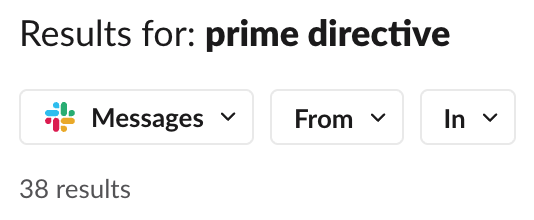
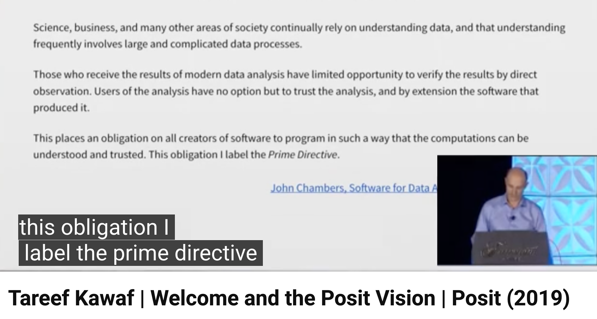
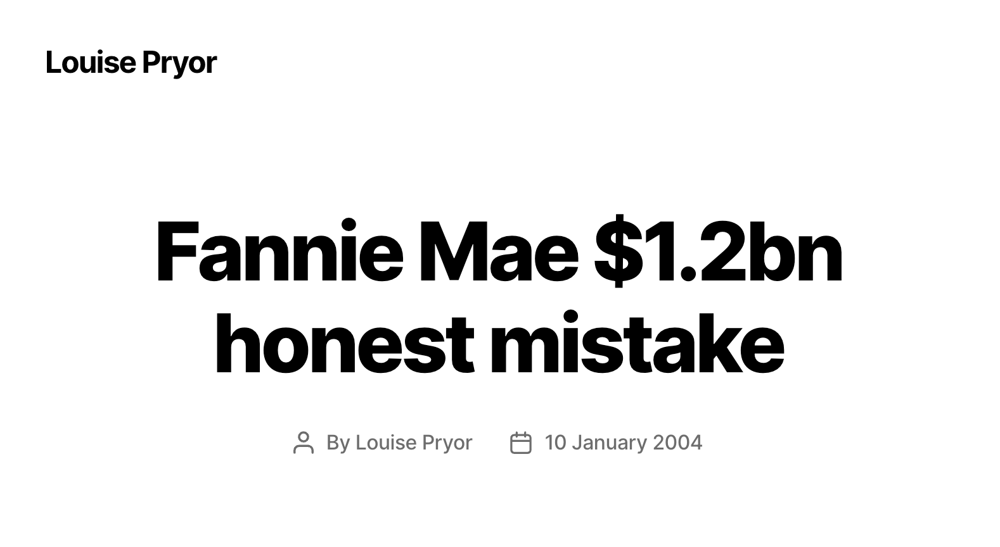
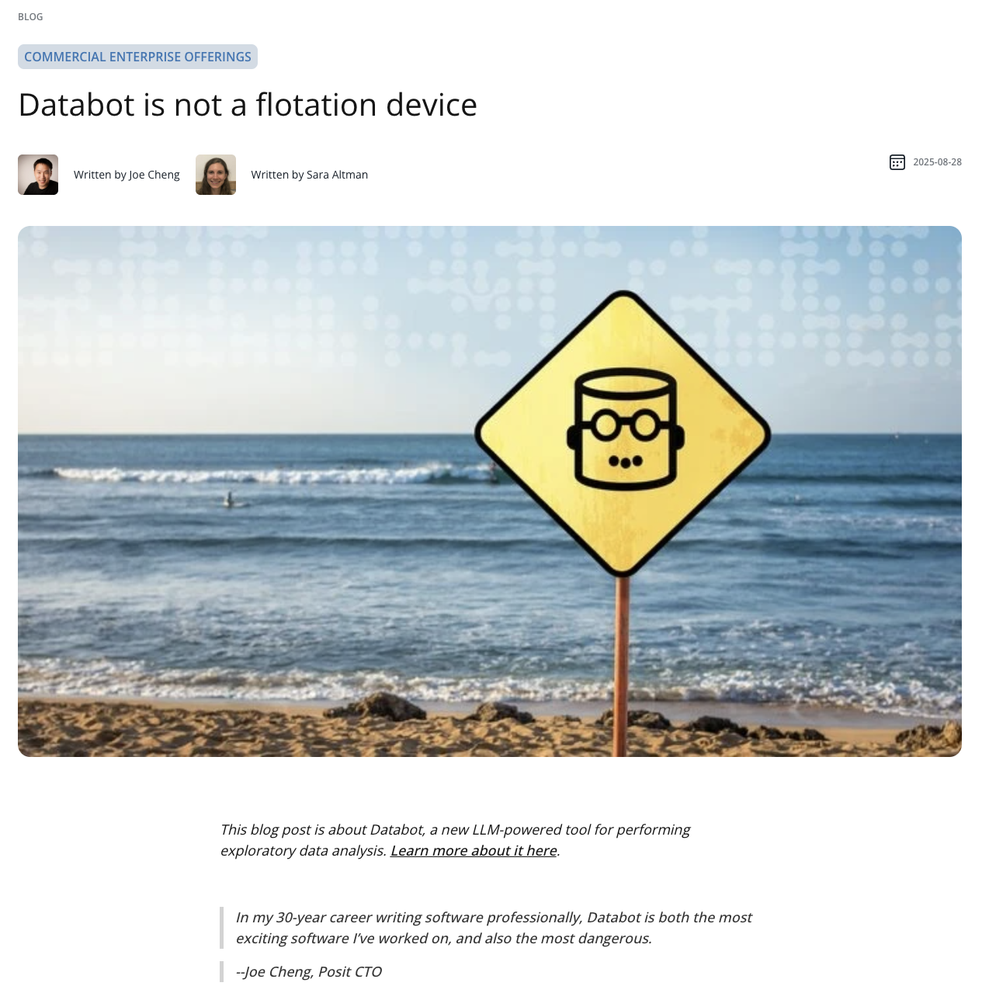
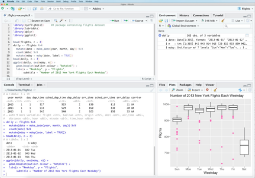

##

::: notes
Simon starts off with the fake story about the first time he listened to this test set episode.
:::

##

{.rounded}

::: notes
Becoming normal to spin up a coding agent, ask a question, and go with whatever the answer is. Sets a low bar for reproducibility, transparency, and correctness.
:::

##

:::notes
The prime directive is very important at Posit. (Screenshot of the many slack or confluence listings with this phrase? But they don't show a total count in the UI.) Maybe a reference to Star Trek (and a joke about how I didn't actually know that was a thing.) 
:::

# The Prime Directive

:::notes
Now, I've actually never seen Star Trek, and only in preparing for this talk did I learn it was a Star Trek reference when I typed just those two words into Google and couldn't find what I was looking for.

I was looking for what _I_ knew as the Prime Directive, which is...
:::

## The Prime Directive {.quote-slide}

<video class="fragment fade-in-then-out attention-fragment attention-fragment-center" preload="auto" loop muted playsinline height="560">
  <source src="figures/subway-surfers.mov">
</video>

> ::: {.fragment}
> _...those who receive the results of modern data analysis have limited opportunity to verify the results by direct observation._
> ::: 
>
> ::: {.fragment}
> _Users of the analysis have no option but to trust the analysis, and by extension the software that produced it._
> ::: 
> 
> ::: {.fragment}
> _Both the data analyst and the software provider therefore have a strong responsibility to produce a result that is trustworthy, and, if possible, one that can be_ shown _to be trustworthy._
> ::: 
>
> ::: {.fragment}
> _...This obligation I label the_ Prime Directive.
> ::: 

<video class="fragment attention-fragment attention-fragment-bottom-right" preload="auto" loop muted playsinline height="400">
  <source src="figures/subway-surfers.mov">
</video>

:::notes
Now, it's 2026 and I've said I'll read a textbook entry...

re: the second-to-last point, this is "You don't have to trust me, here's how to reproduce it yourself."

https://books.google.com.mt/books?id=UXneuOIvhEAC&lpg=PP1&pg=PA1#v=onepage&q&f=false
:::

:::footer
Software for Data Analysis: Programming with R, John Chambers (2008)
:::

##

. . .

  
{.rounded}

:::notes
This comes up internally a _lot_. Admittedly, many of those mentions are from our CEO.
:::

:::footer
:::

##

{.rounded}

:::footer
:::

:::notes
...he's been harping on the PD for a while
:::

##

{.rounded}

::: notes
Let's revisit this with the prime directive in mind...

"Both the data analyst and the software provider therefore have a strong responsibility to produce a result that is trustworthy, and, if possible, one that can be _shown_ to be trustworthy."

First we have to acknowledge that the models are writing code, so that's a good start. Kudos to them.

The code that models write often lives in a temp-file, and unless the user asks for it, is often not backed by an explicit registry of package versions. The chat transcripts from which they could be recovered are, by default, deleted after 30 or 60 days. And even with a reproducible analysis, the model might hallucinate findings, generalize findings beyond what the evidence actually shows, etc.
:::

##

   

::: {.quote}
_“In the battle between convenience and correctness, convenience is winning”_
:::

::: {.attribution}
\- Joe Cheng
:::

:::notes
This is one possible way to summarize  this effect
:::

##

:::notes
...This has always been the case.

Things were not perfect before. Why would Tareef have been speaking about the PD in 2019? Why would John Chambers have written about it in 2008?

Because the prime directive has always been under threat, and reproducibility has never been the norm.
:::

##

{.rounded}

:::footer
https://www.accountingweb.co.uk/business/management-accounting/convivialitys-spreadsheet-hell-sinks-the-business
:::

:::notes
Tareef might have had Conviviality in mind, which had been mistakely reporting healthy financials for years due to a "spreadsheet arithmetic error."

> '£5.2m of that £14m came thanks to “a material error in the financial forecasts”. The error, it later admitted, was “a spreadsheet arithmetic error”.'
:::

##

{.rounded}

:::notes
And, in 2008, John Chambers might have had Fannie Mae in mind, which discovered a $1.136 billion error in total shareholder equity:
> 'There were honest mistakes made in a spreadsheet used in the implementation of a new accounting standard.'

https://www.louisepryor.com/2004/01/10/fanniemae/
:::

:::footer
https://web.archive.org/web/20120917174753/https://www.pcworld.com/article/127189/article.html
:::

##

. . .

   

::: {.quote}
_“In the battle between convenience and correctness, convenience is winning”_
:::

::: {.attribution}
\- Joe Cheng
:::

:::notes
So, the Prime Directive has always been under threat. That said, I don't know that it's necessarily fair to say that convenience and correctness are at battle with each other. They can't be at battle, in the same way that you cannot be in a battle with your VP lol.

The solution then, as it is now, it to make software that is both correct and also very convenient to use, both for the analyst and the end user of the analysis. This is the rationale behind our investment in Shiny, for example. To publish a Shiny app, you click one button that says publish in your IDE and then reproducible R or Python code, with package versions backed by renv or uv, is hosted on Connect and available for your collaborators.
:::

##

{.rounded}

:::notes
Now, I promise this is the last time I'll show this screenshot.

AI, as a new technology, means that the Prime Directive is under threat in a new way. 

In the same way that we couldn't tell our collaborators not to use software that was convenient for them before AI, we can't do it now.

How can we make software that is both correct _and_ convenient? Can we satisfy Chambers' Prime Directive while also making use of the leverage that these new tools provide? This is something that we've been focused on at Posit for the last year and change.
:::

#

# 

{style="display: block; margin: 0 auto;"}

:::footer
&lpar;2025&rpar;
:::

# 

   

::: {.quote}
_“In my 30-year career writing software professionally, Databot is both the most exciting software I’ve worked on, and also the most dangerous.”_
:::

::: {.attribution}
\- Joe Cheng
:::

::: notes
Last year, Joe stood on this stage and told you about Databot.

about a year ago we released databot 
and Joe said said something like this

we were so excited, and also so deeply worried 
and so accompanying the databot announcment post we wrote this
:::

# 

{.rounded}

:::footer
posit.co/blog/databot-is-not-a-flotation-device
:::

::: notes
- Databot flotation device post. This was one of the first things I worked on the AI team. 
- and before we talk about what that post said, I just want you to look at this image
- we basically launched the agent, that we were so excited about, with a warning label
- we were so worried about people trusting its answers when it was wrong
:::

#

::: notes
and given that I think at this point there might be a question on your mind, which
I think is fair to ask and I think we all have asked ourselves in the past few years
:::

# Why are we doing this?!

::: notes
if AI is this agent of chaos further disrupting the prime directive, why involve ourselves at all
and there are many answers
:::

## The mission {.quote-slide}

> ::: {.fragment}
> _The prime directive of the space explorers, notice, was not their mission but rather an important safeguard to apply in pursuing that mission._
> :::
>
> ::: {.fragment}
> _Their mission was to explore, to "boldly go where no one has gone before", and all that._
> :::
>

::: notes
The prime directive does not float unattached. It governs people who are pursuing a mission, and the prime directive is an important safeguard for that mission.

For Star Trek, the mission was to explore, to boldly go where no one has gone before. That is really our mission too: to explore how software can add new abilities for data analysis.

This is Chambers' framing of the Star Trek reference: the prime directive is not the mission. It is the safeguard that governs how the mission is pursued.
:::

:::footer
Software for Data Analysis: Programming with R, John Chambers (2008)
:::

## The mission {.quote-slide}

> ::: {.fragment}
> _Exploration is our mission; we and those who use our software want to find new paths to understand the data and the underlying processes._
> :::

::: notes
That is really our mission too. There is real tension between the mission to explore and create and the prime directive. And maybe more so now with AI. But that tension is the task.

To be clear, this isn't Posit's formal mission statement or the one you'll find on our website. But I do think it is a collective mission for us, for Simon and me, and for many of you in this room.
:::

:::footer
Software for Data Analysis: Programming with R, John Chambers (2008)
:::

## 

{.rounded}

::: notes
For me, and I imagine for many of you, exploration and curiosity are what got us into this room. Maybe it was curiosity about a scientific field that led you to data analysis, or curiosity about the tools themselves, how computers work, or statistics.

For me, it was a little of all of those things. I have always been interested in many things at once. Data is great for that because there is data on everything.

But without the right tools, looking at a data set can feel like looking at the ocean from above. You know there is an incredible amount there, but you cannot see it. You have to know how to access it.

Even with knowledge of statistics and some R as an undergraduate, I felt like I was looking at that ocean from above.
:::

## 

{.rounded}

:::footer
RStudio (2017)
:::

::: notes
Even with knowledge of statistics and some R as an undergraduate, I felt like I was looking at that ocean from above.

Then, as a graduate student, I learned R, the tidyverse, and data science. I could turn a data set over in my hands, say, "huh, that's interesting," and keep digging. Those tools gave me a way to investigate any topic and learn about the world.
:::

## 

{.rounded}

::: notes
the right tools let us see below the surface
The tools enable the curiosity. They reveal the complexity below the surface and let us keep exploring. You can feel curiosity and wonder from a laptop in a fluorescent classroom, typing dplyr and ggplot code by hand.
:::

## {.quote-slide}

> ::: {.fragment}
> _Exploration is our mission; we and those who use our software want to find **new paths to understand the data and the underlying processes.**_
> :::

::: {.fragment}
AI is part of that exploration.
:::

:::footer
Software for Data Analysis: Programming with R, John Chambers (2008)
:::

::: notes
This is what Posit does when we make tools like the tidyverse, RStudio, Positron, ggsql, Workbench, and Connect. 

and we as individuals are motivated by many things, and I know many of us care deeply about making useful tools 
but I think on a day to day basis, what's often motivating us is curiosity and a sense of discovery, about the tools themselves and about what worlds they can unlock. 
:::

## {.quote-slide}

> _Exploration is our mission; we and **those who use our software** want to find new paths to understand the data and the underlying processes._

AI is part of that exploration.

:::footer
Software for Data Analysis: Programming with R, John Chambers (2008)
:::

::: notes
and our users feel this too. we all want to understand our data in new ways!

You could say that a VP vibe-analyzing is lazy, or that it is slop. But often people have questions they are curious about, and they want answers. They are going to reach for the tool that gives them answers.

We should meet them where they are with tools that make their work more correct and trustworthy, not less.

AI is part of our mission to explore. so how do we do that? 
:::

# 

# AI: untrustworthy, but useful?

::: notes
- Here’s a common thought about AI
  - It’s untrustworthy, but useful.
  <!-- Possible place to add bluffbench/bluffbench2 results. If we do that, also need a counter example of usefulness.-->
  - To make it trustworthy, we need people to to verify the output from or supervise agents.
:::

# 

{width=80%}

::: notes
Human in the loop can mean many different things. Here I mean possibly the simplest version: a human is there to verify that what the agent does is correct.
:::

## Naive human-in-the-loop*

::: {.columns}
::: {.column width="40%"}
::: {.fragment}
\* or, the **"slap a human on it"** approach
:::
:::

::: {.column width="60%"}
::: {.fragment}
{width=100% style="border-radius: 0.75rem;"}
:::
:::
:::

# {background-image="figures/databot-flotation-beach.png" background-size="cover" background-position="center"}

::: {.fragment style="position: absolute; top: 43%; left: 2%; width: 45%; margin: 0; padding: 0.75rem 1rem; background: #fff; box-shadow: 0 0.5rem 1.25rem rgb(0 0 0 / 25%); font-size: 0.72em; font-weight: 300; text-align: left;"}
"Databot, and LLMs in general, aren’t at a point where you can abdicate responsibility or suspend skepticism when working with data. ...
Using it well requires the same fundamentals that any good analysis does...These skills help you **catch errors, interpret results in context, and avoid being misled by confident but incorrect claims."**
:::

:::footer
posit.co/blog/databot-is-not-a-flotation-device
:::

::: notes
- And this is pretty close to how we framed the risks of data analysis agents a year ago. 
- The message was basically: Databot is powerful, but can be wrong. Don't abandon your expertise. 

And we were so worried about databot giving wrong answer that we essentially just told people to be worried and vigilant 
:::

# but how?

::: notes
- Now Databot did a bunch of things and did them well. Our framing, however, put most of the responsibility for correctness on the user, to be aware of the risks, to be skeptical of the output without really giving them any strategies.

Underneath it was really one implicit strategy: read the code.
- We pretty quickly realized that people were not going to read the code closely enough for that to be a correctness strategy.
- We didn't really articulate a strategy for helping the user be correct. The strategy was just sort of "make sure you, the human, are there"

I started my career as an educator, and the idea that reading generated code was our strategy for trust raised some red flags. We cannot hand people written material and assume they will read it closely. More importantly, passive reading is not a good way to build the mental model you need to catch mistakes.
:::

# the presence of a human is not enough 

<!-- possibly add an example before handing off --> 

::: notes
Just adding a human, and telling them to be there, is not a correctness strategy.

It's still true that you shouldn't abandon your expertise. But I wouldn't write that post in that way today.

For the rest of the talk, we're going to show you the concrete ways we've built correctness and trust into the tools themselves: first with Posit Assistant, Databot's successor, and then with a new package called commons.
:::

<!-- notes for reframing or adding one more slide
- The Databot post may have been too alarmist because it encouraged people to distrust the output, but not alarmist enough because we had not built trustworthiness into the interaction itself.
- A human is not a fixed safety component. The agent, interface, cognitive load, and trust cues all affect how the person decides.
- The question is not "who checks the output?" but "how do we design the interaction so the entire system can produce trustworthy work?"
- Two goals follow: help the model not be wrong, and make it less bad when it is wrong.
-->
