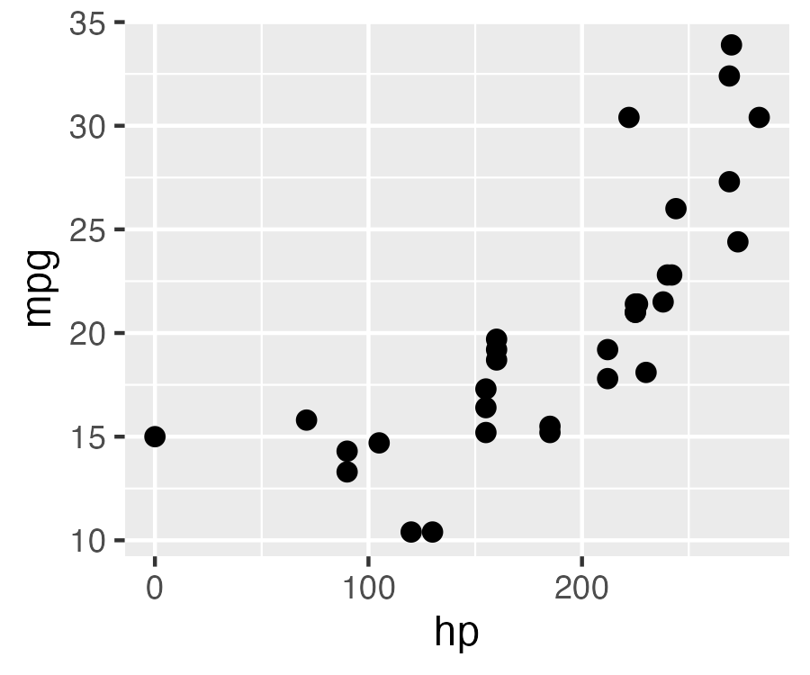

## {.title-slide .green-slide}

::: {.columns}

::: {.column width="68%"}
### Agents for correct, transparent, and reproducible analysis {.talk-title}

::: {.talk-meta}
**Simon Couch and Sara Altman**

posit::conf(2026)
:::
:::

::: {.column width="32%"}
<div class="circle-pair" aria-hidden="true"><span class="circle periwinkle-circle"></span><span class="circle orange-circle"></span></div>
:::

:::

## {.agent-story-slide .slow-tool-calls}

```{=html}
<div class="agent-window">
  <div class="agent-thread">
        <div class="chat-turn chat-turn-user">
          <div class="chat-message chat-message-user">
            how is traffic trending for our site?
          </div>
        </div>
        <div class="chat-turn chat-turn-agent tool-run fragment fade-up" data-fragment-index="0">
          <div class="chat-message chat-message-agent">
            <div class="agent-thinking"><span></span> Analyzing site traffic</div>
            <div class="tool-card" style="--tool-delay: 0s">
              <span class="tool-card-icon">⌕</span>
              <span><strong>Searching workspace</strong><small>web analytics</small></span>
              <span class="tool-progress"><i class="tool-spinner"></i><i class="tool-check">✓</i></span>
            </div>
            <div class="tool-card" style="--tool-delay: 2.25s">
              <span class="tool-card-icon">◫</span>
              <span><strong>Querying warehouse</strong><small>analytics.pageviews</small></span>
              <span class="tool-progress"><i class="tool-spinner"></i><i class="tool-check">✓</i></span>
            </div>
            <div class="tool-card" style="--tool-delay: 3.5s">
              <span class="tool-card-icon">∿</span>
              <span><strong>Calculating daily visits</strong><small>last 90 days</small></span>
              <span class="tool-progress"><i class="tool-spinner"></i><i class="tool-check">✓</i></span>
            </div>
          </div>
        </div>
        <div class="chat-turn chat-turn-agent result-turn fragment fade-up" data-fragment-index="0">
          <div class="chat-message chat-message-agent">
            <p>Daily visits are down <strong>64%</strong> over the last 90 days.</p>
            <div class="dau-chart">
              <div class="dau-chart-title"><span>Daily site visits</span><strong>−64%</strong></div>
              <svg viewBox="0 0 620 225" role="img" aria-label="Daily site visits rise unevenly, then fall sharply after a changepoint.">
                <defs>
                  <linearGradient id="dau-area" x1="0" y1="0" x2="0" y2="1">
                    <stop offset="0%" stop-color="#ee6331" stop-opacity="0.28"/>
                    <stop offset="100%" stop-color="#ee6331" stop-opacity="0.02"/>
                  </linearGradient>
                </defs>
                <g class="chart-grid">
                  <line x1="56" y1="34" x2="598" y2="34"/><line x1="56" y1="86" x2="598" y2="86"/>
                  <line x1="56" y1="138" x2="598" y2="138"/><line x1="56" y1="190" x2="598" y2="190"/>
                </g>
                <g class="chart-labels">
                  <text x="46" y="39">60k</text><text x="46" y="91">40k</text><text x="46" y="143">20k</text>
                  <text x="56" y="215">90 days ago</text><text x="324" y="215">45 days ago</text><text x="598" y="215">Today</text>
                </g>
                <path class="chart-area" d="M56,61 L69,67 L82,58 L95,60 L108,54 L121,59 L134,51 L147,55 L160,57 L173,48 L186,52 L199,45 L212,50 L225,42 L238,46 L251,39 L264,44 L277,36 L290,41 L303,34 L313,37 L319,35 L329,51 L340,57 L351,53 L362,66 L373,61 L384,72 L395,78 L406,73 L417,86 L428,82 L439,95 L450,99 L461,93 L472,108 L483,103 L494,117 L505,113 L516,126 L527,122 L538,134 L549,130 L560,140 L571,137 L582,146 L598,145 L598,190 L56,190 Z"/>
                <path class="chart-line" pathLength="1" d="M56,61 L69,67 L82,58 L95,60 L108,54 L121,59 L134,51 L147,55 L160,57 L173,48 L186,52 L199,45 L212,50 L225,42 L238,46 L251,39 L264,44 L277,36 L290,41 L303,34 L313,37 L319,35 L329,51 L340,57 L351,53 L362,66 L373,61 L384,72 L395,78 L406,73 L417,86 L428,82 L439,95 L450,99 L461,93 L472,108 L483,103 L494,117 L505,113 L516,126 L527,122 L538,134 L549,130 L560,140 L571,137 L582,146 L598,145"/>
                <circle class="chart-end" cx="598" cy="145" r="6"/>
              </svg>
            </div>
          </div>
        </div>
  </div>
</div>
```

:::notes
This morning, your VP pulled up a coding agent and asked a question. 

Now, as data scientists, we might have asked ourselves "How are daily visits being measured?" "What event triggers an entry in this column?" "What other possible explanations could account for this change in trend?" If you had dug further, you would have learned that this kind of pageview event no longer triggers on newer versions of Chrome. As users gradually update Chrome, their page visits are no longer registered in this table, which is not the typical table used to measure site traffic anyway.

Nevertheless, you're not there. Your VP brings this chart to leadership. They decide to restructure the organization and spend millions to reverse the trend.
:::

## {.agent-story-slide .slow-tool-calls}

```{=html}
<div class="agent-window month-later-window">
  <div class="agent-thread">
    <div class="chat-turn chat-turn-user">
      <div class="chat-message chat-message-user">
        could you find the site traffic chart we made a month ago?
      </div>
    </div>
    <div class="chat-turn chat-turn-agent tool-run history-tool-run fragment fade-up" data-fragment-index="0">
      <div class="chat-message chat-message-agent">
        <div class="agent-thinking"><span></span> Looking for prior analysis</div>
        <div class="tool-card" style="--tool-delay: 0s">
          <span class="tool-card-icon">⌕</span>
          <span><strong>Searching conversations</strong><small>site traffic chart</small></span>
          <span class="tool-progress"><i class="tool-spinner"></i><i class="tool-check">✓</i></span>
        </div>
        <div class="tool-card" style="--tool-delay: 1.25s">
          <span class="tool-card-icon">◫</span>
          <span><strong>Checking generated files</strong><small>temporary workspace</small></span>
          <span class="tool-progress"><i class="tool-spinner"></i><i class="tool-check">✓</i></span>
        </div>
      </div>
    </div>
    <div class="chat-turn chat-turn-agent history-missing fragment fade-up" data-fragment-index="0">
      <div class="chat-message chat-message-agent">
        I couldn’t find that conversation or any saved analysis files. Do you want me to recreate that chart for the last 90 days?
      </div>
    </div>
    <div class="chat-turn chat-turn-user fragment fade-up" data-fragment-index="1">
      <div class="chat-message chat-message-user">
        yeah
      </div>
    </div>
    <div class="chat-turn chat-turn-agent tool-run fragment fade-up" data-fragment-index="2">
      <div class="chat-message chat-message-agent">
        <div class="agent-thinking"><span></span> Analyzing site traffic</div>
        <div class="tool-card" style="--tool-delay: 0s">
          <span class="tool-card-icon">⌕</span>
          <span><strong>Searching workspace</strong><small>web analytics</small></span>
          <span class="tool-progress"><i class="tool-spinner"></i><i class="tool-check">✓</i></span>
        </div>
        <div class="tool-card" style="--tool-delay: 1.25s">
          <span class="tool-card-icon">◫</span>
          <span><strong>Querying warehouse</strong><small>analytics.sessions</small></span>
          <span class="tool-progress"><i class="tool-spinner"></i><i class="tool-check">✓</i></span>
        </div>
        <div class="tool-card" style="--tool-delay: 2.5s">
          <span class="tool-card-icon">∿</span>
          <span><strong>Calculating daily visits</strong><small>last 90 days</small></span>
          <span class="tool-progress"><i class="tool-spinner"></i><i class="tool-check">✓</i></span>
        </div>
      </div>
    </div>
    <div class="chat-turn chat-turn-agent result-turn fragment fade-up" data-fragment-index="2">
      <div class="chat-message chat-message-agent">
        <p>Daily visits increased <strong>22%</strong> over the last 90 days.</p>
        <div class="dau-chart">
          <div class="dau-chart-title"><span>Daily site visits</span><strong>+22%</strong></div>
          <svg viewBox="0 0 620 225" role="img" aria-label="Daily site visits trend unevenly upward over the last 90 days.">
            <defs>
              <linearGradient id="traffic-area-up" x1="0" y1="0" x2="0" y2="1">
                <stop offset="0%" stop-color="#23875b" stop-opacity="0.26"/>
                <stop offset="100%" stop-color="#23875b" stop-opacity="0.02"/>
              </linearGradient>
            </defs>
            <g class="chart-grid">
              <line x1="56" y1="34" x2="598" y2="34"/><line x1="56" y1="86" x2="598" y2="86"/>
              <line x1="56" y1="138" x2="598" y2="138"/><line x1="56" y1="190" x2="598" y2="190"/>
            </g>
            <g class="chart-labels">
              <text x="46" y="39">60k</text><text x="46" y="91">40k</text><text x="46" y="143">20k</text>
              <text x="56" y="215">90 days ago</text><text x="324" y="215">45 days ago</text><text x="598" y="215">Today</text>
            </g>
            <path class="chart-area" d="M56,69 L69,74 L82,66 L95,71 L108,63 L121,68 L134,70 L147,61 L160,65 L173,57 L186,64 L199,60 L212,54 L225,58 L238,62 L251,52 L264,56 L277,48 L290,55 L303,51 L316,44 L329,50 L342,47 L355,39 L368,46 L381,43 L394,49 L407,40 L420,44 L433,36 L446,43 L459,38 L472,34 L485,42 L498,37 L511,31 L524,39 L537,35 L550,29 L563,36 L576,33 L589,38 L598,41 L598,190 L56,190 Z"/>
            <path class="chart-line" pathLength="1" d="M56,69 L69,74 L82,66 L95,71 L108,63 L121,68 L134,70 L147,61 L160,65 L173,57 L186,64 L199,60 L212,54 L225,58 L238,62 L251,52 L264,56 L277,48 L290,55 L303,51 L316,44 L329,50 L342,47 L355,39 L368,46 L381,43 L394,49 L407,40 L420,44 L433,36 L446,43 L459,38 L472,34 L485,42 L498,37 L511,31 L524,39 L537,35 L550,29 L563,36 L576,33 L589,38 L598,41"/>
            <circle class="chart-end" cx="598" cy="41" r="6"/>
          </svg>
        </div>
      </div>
    </div>
  </div>
</div>
```

:::notes
A month later, leadership asks to see the chart again. The VP opens up the same agent, but can't find the conversation. (It was deleted after 30 days.) All of the analysis had happened in a tempfile that is long gone. 

The agent offers to make it again. This time, when the VP asks for the same plot, they see that site visits had been steadily trending upward the whole time.
:::

## {.quote-slide .paper-slide}

> In the battle between convenience and correctness, convenience is winning.
>
> <footer>Joe Cheng</footer>

::: notes
AI has largely been a threat to correctness. A broader population of people can now convincingly do data analysis.

It just so happened that Joe said this a month ago, but he could have said it a decade ago and it would still have been true.
:::

##

{.rounded .nostretch width="90%"}

:::footer
<span style="color:#ee6331;">https://www.accountingweb.co.uk/business/management-accounting/convivialitys-spreadsheet-hell-sinks-the-business</span>
:::

::: notes
In 2019, Conviviality (a beverage company) discovered they had been mistakenly reporting healthy financials for years due to a “spreadsheet arithmetic error.”

> £5.2m of that £14m came thanks to “a material error in the financial forecasts”. The error, it later admitted, was “a spreadsheet arithmetic error”.
:::

##

{.rounded .nostretch width="80%"}

:::footer
https://www.science.org/doi/10.1126/science.314.5807.1856
:::

:::notes
A lab studying protein structures used an in-house, closed source program analyze data. It contained a bug that flipped the sign of a computation. From 2001 to 2006, Geoffrey Chang published a series of heavy-hitting papers that reshaped his field, while other labs struggled to reproduce their findings. The bug came to light when another lab solved a similar protein structure that produced a mirror image of Chang's. At this point, the Chang lab checked their code, found the bug, and retracted 5 papers.
:::

## 

. . .

{height="650" style="display: block; margin: 0 auto;"}

:::notes
There have always been threats to correctness in data analysis. This is why Posit was founded; correctness in high-stakes data analysis has always been our thing. But our stance was not "you need to forgo convenience in favor of correctess."
:::

:::footer
rstudioblog.wordpress.com/2011/02/27/about-the-rstudio-project/
:::

## {.quote-slide .compact-quote .paper-slide}

> Our goal is to develop a powerful tool that supports [trustworthy, high quality analysis]{.accent}.
>
> <br>
>
> At the same time, we want RStudio to be as [straightforward and intuitive]{.accent} as possible.
>
> <footer>JJ Allaire, 2011</footer>

:::footer
https://rstudioblog.wordpress.com/2011/02/28/rstudio-new-open-source-ide-for-r/
:::

:::notes
He's saying "it can be correct _and_ convenient."

With AI, our stance needs to be the same. How do we build data analysis agents that are both correct and convenient to use?
:::

# {.paper-slide}

::: notes
this pull between correctness and convenience has weighed on all of our minds in this new age of llms

and it became especially relevant last year in 2025
for us and for many of you I imagine 2025 was the year AI got very very convenient and we needed to think seriously about correctness 

and we were so worried 
:::

## {.split-image-slide .split-40 .split-image-top background-image="figures/databot-flotation-blog-cropped.png"}

::: {.columns}

::: {.column}
### August 2025 {.split-title}
:::

::: {.column role="img" aria-label="Illustration of a databot mascot wearing a flotation device"}
:::

:::

:::footer
posit.co/blog/databot-is-not-a-flotation-device
:::

::: notes
so worried that when we released our new sota coding agent in 2025, we did so under what was essentially a warning label

this is an image from a blog post joe and I wrote to accompany the release of databot, which was an exploratory data analysis agent that lived in positron

and this post was actually one of the first things I worked when I joined the AI team, and it gave me the opportunity to do one of the things that I think I do best: be a pessimist 
:::

# {background-image="figures/getty-images-YqJdF4TIxG0-unsplash.jpg" background-size="cover" background-position="center"}

:::footer
Getty Images
:::

# {background-image="figures/databot-flotation-no-swimming.png" background-size="cover" background-position="center"}

:::footer
Thank you Margaret Biffar and Isabella Velásquez!
:::

# {.paper-slide}

{style="display: block; margin: 0 auto;"}

::: notes
because we were all so excited about databot, but also so worried about people trusting its answers when it was wrong

that we wrote an entire blog post explaining the ways in which it might fail
:::

# {.quote-slide .compact-quote .paper-slide}

> In my 30-year career writing software professionally, Databot is both the [most exciting software]{.accent} I've worked on, and also the\
> [most dangerous]{.accent}.
>
> <footer>Joe Cheng, Posit CTO</footer>

::: notes
and if you were here at conf last year, you might remember Joe's keynote where said somethign a bit like this
:::


# {.paper-slide}

::: notes
and given that I think at this point there might be a question on your mind, which
I think is fair to ask and I think we all have asked ourselves in the past few years
:::

# {.statement-slide .paper-slide}

::: {.statement}
Why are we doing this?!
:::

::: notes
if AI is this agent of chaos that we are so worried, why involve ourselves at all

and there are many answers, one of which is that things change quickly. something you might have worried abotu yesterday is no longer true today

and so in light of that its worth briefly checking in on how we see llms for data analysis right now in september 2026
:::

# {.header-slide .blue-slide}

::: {.columns}

::: {.column .header-text width="100%"}
The state of AI for data science in 2026
:::

:::

::: notes
or maybe "sara and simon's opinionated take on"
:::

## 1. The models got better {.beat-slide}

```{r}
#| include: false
library(ggplot2)
library(dplyr)
library(forcats)
library(ggforce)

original_results_env <- new.env()
load("data/bluffbench-original-results.rda", envir = original_results_env)
bluffbench_original_results <- original_results_env$bluff_results

latest_results_env <- new.env()
load("data/bluffbench-latest-results.rda", envir = latest_results_env)
bluffbench_latest_results <- latest_results_env$bluff_results

bluffbench_results_theme <-
  theme_minimal(base_size = 22) +
  theme(
    plot.background = element_rect(fill = "#f5f2ec", color = NA),
    panel.background = element_rect(fill = "#f5f2ec", color = NA),
    legend.background = element_rect(fill = "#f5f2ec", color = NA),
    legend.key = element_rect(fill = "#f5f2ec", color = NA),
    panel.grid.minor = element_blank(),
    panel.grid.major = element_line(color = "#dedbd5"),
    text = element_text(color = "#24437b"),
    axis.text = element_text(color = "#24437b"),
    strip.background = element_blank(),
    strip.text = element_text(color = "#24437b", face = "bold"),
    plot.title.position = "plot"
  )

bluffbench_mtcars <- mtcars
bluffbench_mtcars$hp <- max(bluffbench_mtcars$hp) - bluffbench_mtcars$hp

bluffbench_mtcars_plot <-
  ggplot(bluffbench_mtcars, aes(x = hp, y = mpg))

ggsave(
  "figures/bluffbench-mtcars-hp-mpg-thumb.png",
  bluffbench_mtcars_plot + geom_point(size = 2),
  width = 3,
  height = 2.5
)

set.seed(617)

n <- 150
n_imp <- 35
sleep_hours <- round(runif(n, 4, 10), 1)
stress_score <- round(
  pmin(pmax(95 - 7.5 * sleep_hours + rnorm(n, 0, 8), 5), 95),
  1
)

imp_sleep <- round(runif(n_imp, 4.5, 9.5), 1)
imp_stress <- round(95 - 7.5 * imp_sleep, 1)

wellbeing_data <- data.frame(
  sleep_hours = c(sleep_hours, imp_sleep),
  stress_score = c(stress_score, imp_stress)
)

library(bluffbench2)
library(scales)

bluff2_summary <-
  bluff2_results |>
  summarize(
    score = (sum(score == "C") + (sum(score == "P") * .5)) / n(),
    .by = model
  ) |>
  mutate(model = gsub(" (medium)", "", model, fixed = TRUE))
```

## {.paper-slide}

::: {style="display: flex; flex-direction: column; gap: 0; padding: 20px; max-width: 100%; margin: 20px auto 0 auto;"}

::: {.fragment style="align-self: flex-end; background-color: #d6eaf8; padding: 12px 18px; border-radius: 18px 18px 4px 18px; max-width: 70%; box-shadow: 0 2px 4px rgba(0,0,0,0.1);"}
Please plot hp vs mpg in mtcars
:::

::: {.fragment style="align-self: flex-start; background-color: white; padding: 10px; border-radius: 18px 18px 18px 4px; max-width: 70%; box-shadow: 0 2px 4px rgba(0,0,0,0.1); border: 1px solid #e0e0e0; margin-top: 10px;"}

::: {style="background-color: #f6f8fa; border: 1px solid #e0e0e0; border-radius: 10px; padding: 8px 12px;"}
```{.r style="margin: 0; font-size: 0.8em; background: none; border: none; box-shadow: none; padding: 0;"}
ggplot(mtcars, aes(x = hp, y = mpg)) +
  geom_point()
```
:::

{fig-alt="A small scatterplot thumbnail with horsepower on the x-axis and miles per gallon on the y-axis. The points form a strong positive association." width="260px" style="border-radius: 12px; display: block; margin: 10px auto 0 auto;"}

:::

::: {.fragment style="align-self: flex-start; background-color: white; padding: 12px 18px; border-radius: 18px 18px 18px 4px; max-width: 70%; box-shadow: 0 2px 4px rgba(0,0,0,0.1); border: 1px solid #e0e0e0; margin-top: 10px;"}
There is a **strong, negative association.**
:::

:::

:::footer
posit-dev.github.io/bluffbench
:::

::: notes
bluffbench tests whether a model reports what is actually plotted or falls back
on what it expects from a well-known dataset.

The model receives the rendered plot. Here, the relationship is positive, but
the model describes the familiar negative relationship from the original data.
:::

## {.paper-slide}

::: {.plot-slide-content}

```{r}
#| echo: false
#| fig-align: center
#| fig-alt: "A scatterplot of horsepower against miles per gallon. The points form a clear positive association, with miles per gallon generally rising as horsepower rises."
#| fig-width: 12
#| fig-height: 6
#| fig-bg: "#f5f2ec"
#| out-width: "92%"
bluffbench_mtcars_plot +
  geom_point(size = 3) +
  theme(
    plot.background = element_rect(fill = "#f5f2ec", color = NA),
    axis.title = element_text(size = 30, color = "#24437b"),
    axis.text = element_text(size = 22, color = "#24437b")
  )
```

:::

## November 2025 {.paper-slide}

::: {.plot-slide-content}

```{r}
#| echo: false
#| fig-align: center
#| fig-alt: "A horizontal stacked bar chart titled 'Models often report what they expect to see, not what's plotted.' GPT-5, Gemini Pro 2.5, and Claude Sonnet 4.5 are mostly incorrect."
#| fig-width: 12
#| fig-height: 7.5
#| fig-bg: "#f5f2ec"
#| out-width: "70%"
bluffbench_original_results |>
  filter(type == "mocked") |>
  mutate(score = fct_recode(score, "Correct" = "C", "Incorrect" = "I")) |>
  ggplot(aes(y = model, fill = score)) +
  geom_bar(position = "fill") +
  scale_fill_manual(
    name = NULL,
    breaks = c("Correct", "Incorrect"),
    values = c("Correct" = "#67a9cf", "Incorrect" = "#ef8a62")
  ) +
  scale_x_continuous(labels = scales::percent) +
  labs(
    title = "Models often report what they expect to see, not what's plotted",
    subtitle = "With well-known datasets",
    x = NULL,
    y = NULL
  ) +
  bluffbench_results_theme +
  theme(
    plot.title = element_text(size = 26, face = "bold"),
    plot.subtitle = element_text(size = 18),
    axis.text.x = element_text(size = 18),
    axis.text.y = element_text(size = 20),
    legend.position = "top",
    legend.justification = "left",
    legend.text = element_text(size = 18)
  )
```

:::

:::footer
posit-dev.github.io/bluffbench
:::

::: notes
We tried a range of interventions to improve these scores, but none moved them
much. Even when a model noticed during its reasoning that the association did
not look as expected, it often still reported the expected relationship.
:::

## July 2026 {.paper-slide}

::: {.plot-slide-content}

```{r}
#| echo: false
#| fig-align: center
#| fig-alt: "A faceted horizontal stacked bar chart of percent correct across recent models, split into thinking and no-thinking groups. Thinking models perform better, while most models still give many incorrect answers."
#| fig-width: 12
#| fig-height: 7.5
#| fig-bg: "#f5f2ec"
#| out-width: "70%"
bluffbench_latest_results |>
  filter(type == "mocked", !grepl("Gemma", model)) |>
  mutate(
    score = fct_recode(score, "Correct" = "C", "Incorrect" = "I"),
    pct_correct = ave(score == "Correct", model, FUN = mean),
    model = reorder(model, pct_correct),
    thinking = factor(
      ifelse(thinking, "Thinking", "No thinking"),
      levels = c("Thinking", "No thinking")
    )
  ) |>
  ggplot(aes(y = model, fill = score)) +
  geom_bar(position = "fill") +
  facet_col(vars(thinking), scales = "free_y", space = "free") +
  scale_fill_manual(
    name = NULL,
    values = c("Correct" = "#67a9cf", "Incorrect" = "#ef8a62")
  ) +
  scale_x_continuous(labels = scales::percent) +
  labs(title = "The models got better", x = "Percent correct", y = NULL) +
  bluffbench_results_theme +
  theme(
    plot.title = element_text(size = 26, face = "bold"),
    axis.text.x = element_text(size = 18),
    axis.text.y = element_text(size = 14, angle = 45, hjust = 1),
    axis.title.x = element_text(size = 22),
    strip.text = element_text(size = 22, hjust = 0),
    legend.position = "none",
    plot.margin = margin(5.5, 5.5, 15, 5.5)
  )
```

:::

:::footer
posit-dev.github.io/bluffbench
:::

## 2. Trustworthy analysis still takes more than a frontier model. {.beat-slide}

## {.paper-slide}

::: {.plot-slide-content}

```{r}
#| echo: false
#| fig-align: center
#| fig-alt: "A scatterplot of sleep hours against stress score with a negative trend. A subset of points falls exactly along a straight line, suggesting a data-quality artifact."
#| fig-width: 12
#| fig-height: 6
#| fig-bg: "#f5f2ec"
#| out-width: "92%"
ggplot(wellbeing_data, aes(x = sleep_hours, y = stress_score)) +
  geom_point(alpha = 0.8, size = 3) +
  labs(x = "sleep (hours)", y = "stress score") +
  bluffbench_results_theme +
  theme(
    axis.title = element_text(size = 30),
    axis.text = element_text(size = 22)
  )
```

:::

:::footer
github.com/posit-dev/bluffbench2
:::

::: notes
bluffbench2 tests whether models notice subtle data quality issues in
visualizations.

In this example, most points follow a noisy negative relationship, but a subset
falls exactly on a straight line. Those values were imputed with a regression
model, so they are not real measurements and should be investigated before
continuing the analysis.
:::

## {.paper-slide}

::: {.plot-slide-content}

```{r}
#| echo: false
#| fig-align: center
#| fig-alt: "A horizontal bar chart of bluffbench2 scores by model. Every model scores below 50 percent, showing that frontier models still struggle to notice subtle data-quality issues."
#| fig-width: 12
#| fig-height: 7
#| fig-bg: "#f5f2ec"
#| out-width: "78%"
bluff2_summary |>
  mutate(model = fct_reorder(model, score)) |>
  ggplot() +
  aes(x = score, y = model) +
  geom_col(fill = "#2c84e1") +
  scale_x_continuous(labels = label_percent(), limits = c(0, 1)) +
  labs(
    x = "Score",
    y = NULL,
    title = "Frontier models still struggle to notice subtle data quality issues"
  ) +
  bluffbench_results_theme +
  theme(
    plot.title = element_text(size = 26, face = "bold"),
    axis.text.y = element_text(size = 22),
    axis.text.x = element_text(size = 20)
  )
```

:::

:::footer
github.com/posit-dev/bluffbench2
:::

::: notes
Across models, performance remains low. These are visual data-quality issues
that a data scientist would want an analysis agent to notice before interpreting
the apparent relationship.
:::

# {.statement-slide .paper-slide}

::: {.statement}
Data analysis depends on [context]{.accent} that is not in the data.
:::

::: notes
but there is a second problem: data analysis depends on context that is not in the data

definitions, provenance, collection decisions, and domain knowledge all shape whether an analysis is correct

a human expert often holds that context, which is one reason putting a human in the loop feels like the obvious answer
:::

## 3. Our mission is to find new ways to understand data. LLMs are part of that exploration. {.beat-slide}

::: notes
but for me and I think many of us at posit, much of the answer has to do with a sense of curiosity and exploration
:::

##

## {background-image="figures/mission-ocean.jpg" background-size="cover" background-position="center"}

::: notes
for myself and i imagine for many of you, a sense of exploration and curiosity are what got us here in the first place. 

Maybe it was curiosity about a scientific field that led you to data analysis, or curiosity about the tools themselves, how computers work, or statistics.

But without the right tools, data can be impenetrable. As an undergraduate with knowledge of statistics and some R as an undergraduate, I felt like I was looking at an ocean from above.You know there is an incredible amount there, but you cannot see it. 

learning the tidyverse, and data science...these tools gave me a way to investigate any topic and learn about the world.
:::

## {.split-image-slide background-image="figures/oceanimagebank-rays.jpg"}

::: {.columns}

::: {.column}
### The right tools let us see below the surface. {.split-title}
:::

::: {.column role="img" aria-label="A school of rays swimming below the ocean surface"}
:::

:::

<div class="image-credit">Photo: Lars von Ritter Zahony / Ocean Image Bank</div>

::: notes
the right tools let us see below the surface
The tools enable the curiosity. 
:::

# {.statement-slide .paper-slide}

::: {.statement}
AI is a [continuation]{.accent} of our work to find [new ways to explore data]{.accent}.
:::

::: notes
But AI is also a continuation of work that Posit and this community have always done. We are curious about new tools: how they work, what they make possible, and we turn drive into tools that open up new worlds of analysis. 
:::

# {.beat-slide}

::: {.incremental}
* The models got better
* But that doesn't solve everything!
* We want to continue making new software to explore data
:::

::: notes
all three point in the same direction: we are going to keep going down the LLM path. so then the question becomes... 
:::

# {.header-slide .blue-slide}

::: {.columns}

::: {.column .header-text width="64%"}
How do we make AI trustworthy?
:::

::: {.column width="36%"}
{.header-image fig-alt="Orange shield"}
:::

:::

# {.paper-slide .diagram-slide}



::: notes
- Here’s a common thought about AI
  - It’s untrustworthy, but useful.
  - To make it trustworthy, we need people to verify the output from or supervise agents.

Human in the loop can mean many different things. for now we're just talking about a really simple version: a human is there to verify that what the agent does is correct and provide appropriate redirection if not.

it is an intuitively appealing division of labor. the agent does what it's good at, the human provides the judgment to keep it from going off the rails.
:::

## {.paper-slide}

::: {style="display: flex; height: 100%; flex-direction: column; align-items: center; justify-content: center; gap: 0.75rem;"}
{style="width: auto; max-height: 540px; margin: 0; border-radius: 0.75rem;"}

<div class="fragment" style="min-height: 1.15em; margin: 0; font-size: 1.2em; line-height: 1.15;">*the <strong>slap a human on it</strong> approach</div>
:::

::: notes
this sounds so nice! the human is there to prevent mistakes and all will be good. so we should just apply this anywhere we see a problem.

I like to call this simplistic division of labor the "slap a human on it" approach.

there's only one problem: this simple view is not how these systems work.

you can't assume that just because a human is present and technically "in the loop," you've solved the issue of correctness by asking them to verify something.

and this is not a straw man. it is pretty close to how we framed risk mitigation for Databot.
:::

# {background-image="figures/databot-flotation-beach.png" background-size="cover" background-position="center"}

::: {.fragment style="position: absolute; top: 43%; left: 2%; width: 45%; margin: 0; padding: 0.75rem 1rem; background: #f5f2ec; color: #24437b; box-shadow: 0 0.5rem 1.25rem rgb(0 0 0 / 25%); font-size: 0.72em; font-weight: 700; text-align: left;"}
"Databot, and LLMs in general, aren’t at a point where you can abdicate responsibility or suspend skepticism when working with data. ...
These skills help you <span style="color:#dd5d7b;">catch errors, interpret results in context, and avoid being misled by confident but incorrect claims."</span>
:::

:::footer
<span style="color:#fff1c9;">posit.co/blog/databot-is-not-a-flotation-device</span>
:::

::: notes
we wrote a whole article about the dangers of Databot and why users needed to remain skeptical and apply their expertise

All of that is still true. I stand by it. It's inspirational! I would love to avoid being misled by confident but incorrect claims.

but notice that this puts the responsibility for correctness on the user: be there, remain vigilant, and apply your expertise

underneath it was one implicit strategy: stay vigilant and read the code
:::

# {.paper-slide .hitl-evidence-slide}

::: {.hitl-evidence-heading}
Adding a human [does not guarantee]{.accent} a better result.
:::

::: {.hitl-evidence-points .incremental}
- Human-AI combination often underperforms one or the other. 
- People are often biased to follow automated recommendations.
- People get tired of approving requests.
- Trust, timing, cognitive load, social cues, and information design all shape decisions.
:::

:::footer
Vaccaro et al. (2024); Parasuraman and Manzey (2010); Anthropic (2026)
:::

::: notes
a 2024 meta-analysis looked at 106 experimental studies that compared humans alone, AI alone, and human-AI teams

on average, the combination performed worse than the better of the human or AI alone. decision tasks showed particular losses

this does not mean every human-AI team is worse. it means that adding a human does not automatically produce a better system

human judgment does not stay fixed when we put someone into an agent system

automation bias is one example: in soem situations, people can follow an automated recommendation even when it is wrong

approval fatigue can be a big issue
think about your own coding agent. when it asks you to approve a command, how often do you carefully read it, and how often do you just hit accept?

trust, timing, cognitive load, social cues, the interface, and the amount of information all affect how someone decides whether code or an action is correct or safe
:::

# {.statement-slide .paper-slide}

::: {.statement}
People are [not fixed safety components.]{.accent}
:::

::: notes
because people are not fixed safety components 
we can't just slot them in whenever we are worried an agent system might be wrong
:::

# {.beat-slide}

[How do we design the entire system to produce trustworthy work?]{.fragment}

::: notes
the question is how we design the interaction and the entire system so that human expertise can actually support correctness
:::

# {.paper-slide}

<ul>
  <li class="fragment" data-fragment-index="0">
    Build trust and correctness into the system itself
    <ul>
      <li class="fragment" data-fragment-index="2"><strong>Help the agent be correct.</strong></li>
    </ul>
  </li>
  <li class="fragment" data-fragment-index="1">
    Consider how interaction works with the user and can support their expertise
    <ul>
      <li class="fragment" data-fragment-index="3"><strong>Make it less bad when it's wrong.</strong></li>
    </ul>
  </li>
</ul>

::: notes
instead, today we are going talk about the new concrete approaches built into the systems themselves that push them towards correctness. first in posit assistant, databot's successor, and then in a new open source library

and specifically, encode correctness into the agent itself 
and design the interaction to support human expertise when the model will inevitably make mistakes. 

In other words: help the agent be correct, and make it less bad when it's wrong.
:::

## {.paper-slide}

{.rounded .nostretch height="650"}

:::notes
Our flagship agent is Posit Assistant. Posit Assistant is a coding and data science agent. It's available in RStudio, Positron, and the terminal. When it's running inside of your IDE, it works inside of your active R and Python session. You can use whatever model from whatever provider you want with it.
:::

:::footer
assistant.posit.co
:::

##

:::notes
Sara described her first moments of really wrapping her head around data science tools as like seeing below the surface. I think many of us might have had a moment like this at some point, when we began to understand how powerful data science and statistics are for answering questions about the world.

The first time I felt this way, I had been asked to use R to understand what affects flight delays. I had to load in some data and then write dplyr and ggplot to see if I could make any decisions that would give me better chances of my flight leaving on time. 

In demoing Posit Assistant, I thought I might revisit that moment with you. 
:::

##

<video class="rounded click-to-toggle" width="100%" preload="auto" tabindex="0" aria-label="Click to play or pause">
  <source src="figures/01-pa-demo-webfetch.mp4">
</video>

:::notes
It can do normal coding agent stuff
:::

##

<video class="rounded click-to-toggle" width="100%" preload="auto" tabindex="0" aria-label="Click to play or pause">
  <source src="figures/02-pa-demo-docs.mp4">
</video>

:::notes
It can read documentation (in the same way that you would, too)

Also, note that it preferred to keep data in the file system
:::

##

<video class="rounded click-to-toggle" width="100%" preload="auto" tabindex="0" aria-label="Click to play or pause">
  <source src="figures/03-pa-demo-clean-data.mp4">
</video>

:::notes
* Cleaning mode: we felt that most coding agents had a superficial relationship with data quality
* It pays attention to missing data, outliers, etc
* Cleaning script is persisted
:::

##

<video class="rounded click-to-toggle" width="100%" preload="auto" tabindex="0" aria-label="Click to play or pause">
  <source src="figures/04-pa-demo-plots.mp4">
</video>

:::notes
You can see plots
:::

##

<video class="rounded click-to-toggle" width="100%" preload="auto" tabindex="0" aria-label="Click to play or pause">
  <source src="figures/05-pa-demo-carriers.mp4">
</video>

:::notes
The agent shows restraint in interpretation; is concerned about sample sizes before interpreting this anomoly in the plot
:::

##

<video class="rounded click-to-toggle" width="100%" preload="auto" tabindex="0" aria-label="Click to play or pause">
  <source src="figures/06-pa-demo-report.mp4">
</video>

:::notes
Slash commands (has a bunch of specialized skills) + can write quarto reports
:::

##

<video class="rounded click-to-toggle" width="100%" preload="auto" tabindex="0" aria-label="Click to play or pause">
  <source src="figures/07-pa-demo-preview.mp4">
</video>

:::notes
Can use your IDE in the normal way
:::

##

<video class="rounded click-to-toggle" width="100%" preload="auto" tabindex="0" aria-label="Click to play or pause">
  <source src="figures/08-pa-demo-model-cost.mp4">
</video>

:::notes
The whole conversation was 10 cents. Part of our mission is providing the best tools to folks regardless of their economic means, and we remain committed to that. Totally free usage is not possible—AI inference is quite expensive—but Posit Assistant is token efficient, and we've worked hard to serve incredibly cheap and capable open-weights models with strong privacy guarantees. Per token, this model, GLM 5.3 Flash, is less than a thirtiest of the price of Claude Opus 5, and is served under Zero Data Retention.
:::

##

{.rounded .nostretch height="650"}

:::notes
We've designed Posit Assistant to be more correct, and we've designed it to make better use of your expertise than other coding agents, so that you're more likely to know when it's wrong.
:::

:::footer
assistant.posit.co
:::

<!-- commons lead in --> 

# {.statement-slide .paper-slide}

<br><br>

::: {.statement .regular-weight}
Help the model not be wrong [**by encouraging sound statistics and reproducibility practices**]{.fragment}<br><br>
Make it less bad when it is wrong [**by making good use of your expertise and sharing an R/Python environment**]{.fragment}
:::

# But what if the user is not a data scientist?

::: notes
The VP does not have data science expertise and does not know how to use R and Python
:::

##

```{=html}
<div class="agent-window vp-reminder-window">
  <div class="agent-thread">
    <div class="chat-turn chat-turn-user">
      <div class="chat-message chat-message-user">
        how is traffic trending for our site?
      </div>
    </div>
    <div class="chat-turn chat-turn-agent result-turn">
      <div class="chat-message chat-message-agent">
        <p>Daily visits are down <strong>64%</strong> over the last 90 days.</p>
        <div class="dau-chart">
          <div class="dau-chart-title"><span>Daily site visits</span><strong>−64%</strong></div>
          <svg viewBox="0 0 620 225" role="img" aria-label="Daily site visits rise unevenly, then fall sharply after a changepoint.">
            <defs>
              <linearGradient id="dau-area-reminder" x1="0" y1="0" x2="0" y2="1">
                <stop offset="0%" stop-color="#ee6331" stop-opacity="0.28"/>
                <stop offset="100%" stop-color="#ee6331" stop-opacity="0.02"/>
              </linearGradient>
            </defs>
            <g class="chart-grid">
              <line x1="56" y1="34" x2="598" y2="34"/><line x1="56" y1="86" x2="598" y2="86"/>
              <line x1="56" y1="138" x2="598" y2="138"/><line x1="56" y1="190" x2="598" y2="190"/>
            </g>
            <g class="chart-labels">
              <text x="46" y="39">60k</text><text x="46" y="91">40k</text><text x="46" y="143">20k</text>
              <text x="56" y="215">90 days ago</text><text x="324" y="215">45 days ago</text><text x="598" y="215">Today</text>
            </g>
            <path class="chart-area" d="M56,61 L69,67 L82,58 L95,60 L108,54 L121,59 L134,51 L147,55 L160,57 L173,48 L186,52 L199,45 L212,50 L225,42 L238,46 L251,39 L264,44 L277,36 L290,41 L303,34 L313,37 L319,35 L329,51 L340,57 L351,53 L362,66 L373,61 L384,72 L395,78 L406,73 L417,86 L428,82 L439,95 L450,99 L461,93 L472,108 L483,103 L494,117 L505,113 L516,126 L527,122 L538,134 L549,130 L560,140 L571,137 L582,146 L598,145 L598,190 L56,190 Z"/>
            <path class="chart-line" pathLength="1" d="M56,61 L69,67 L82,58 L95,60 L108,54 L121,59 L134,51 L147,55 L160,57 L173,48 L186,52 L199,45 L212,50 L225,42 L238,46 L251,39 L264,44 L277,36 L290,41 L303,34 L313,37 L319,35 L329,51 L340,57 L351,53 L362,66 L373,61 L384,72 L395,78 L406,73 L417,86 L428,82 L439,95 L450,99 L461,93 L472,108 L483,103 L494,117 L505,113 L516,126 L527,122 L538,134 L549,130 L560,140 L571,137 L582,146 L598,145"/>
            <circle class="chart-end" cx="598" cy="145" r="6"/>
          </svg>
        </div>
      </div>
    </div>
  </div>
</div>
```

::: notes
The VP had good intentions. They wanted an answer to their question, and reached for a tool convenient to them. 

Unfortunately, the answer they got was wrong.

But, we mentioned earlier that this isn't the table that the data scientists usually use to measure site traffic. The data scientists calculate that metric against a different table, and the code that they use to do lives in a semantic view in their database.
:::

# [_Trusted_ code]{style="color: #ee6331; font-size: 1.4em;"}

::: notes
We'll call this _trusted_ code
It's been vetted and maintained by the data team

They also might have trusted code in

* Shiny apps
* R and Python packages
* Quarto documents

Instead of the model writing code afresh every time it's answering a question, what if it could discover and use this code?

This is one of the core ideas behind a new open source package that we're excited to share with you all today. It's called commons.
:::

# {.commons-intro-slide}

{.commons-intro-logo .nostretch fig-alt="Commons logo"}

::: notes
commons helps data scientists build trustworthy data agents for their collaborators.

It's an open source R and Python package built on `ellmer` / `chatlas` and `shinychat`. You can use it with whatever model from whatever provider you want.
:::

##

<video class="rounded click-to-toggle" width="100%" preload="auto" tabindex="0" aria-label="Click to play or pause">
  <source src="figures/commons-01-traffic-trend.mp4">
</video>

::: notes
let's see how the VP's analysis would work with a commons agent

The agent searches for a trusted calculation before writing custom code. Here it
finds and runs the data scientist's site traffic calculation

the answer is marked as verified to signify that it used vetted code
:::

## 

<video class="rounded click-to-toggle" width="100%" preload="auto" tabindex="0" aria-label="Click to play or pause">
  <source src="figures/commons-02-page-views.mp4">
</video>

::: notes
However, its unlikely that this trusted code will cover all questions a user might have.
for these situations, the agent can write custom r, python, or sql 

here, there is no trusted calculation for this question, so the model writes some custom code

Commons preserves that convenience, but marks
the answer as untrusted.
:::

##

<video class="rounded click-to-toggle" width="100%" preload="auto" tabindex="0" aria-label="Click to play or pause">
  <source src="figures/commons-03-most-visits.mp4">
</video>

::: notes
but this custom code isn't entirely untrustworthy
to make it as trustworthy as possible, the data team first encodes additional useful context for the agent, in the form of data dictionaries and markdown files. 

this information is available for the agent to search through, helping it write correct custom code 

Here it explains the instrumentation artifact and cites the
trusted context that supports that explanation.

correctness and convenience
:::

## Deterministically tag trust {.trust-flow-slide .paper-slide}

<br>

```{=html}
<div class="trust-flow" role="img" aria-label="Commons searches trusted calculations, then marks answers based on whether they use a trusted calculation or a lower-trust custom path.">
  <div class="trust-tool trust-search">Search trusted calculations</div>
  <div class="trust-route-labels" aria-hidden="true">
    <span><span>Find one</span><span class="trust-decision-arrow">↓</span></span>
    <span><span>Don’t find one</span><span class="trust-decision-arrow">↓</span></span>
  </div>
  <div class="trust-branches">
    <div class="trust-branch trust-branch-high">
      <div class="trust-tool">Run trusted calculation</div>
      <span class="trust-down-arrow" aria-hidden="true">↓</span>
      <div class="trust-marker">
        
      </div>
    </div>
    <div class="trust-branch trust-branch-lower">
      <div class="trust-tool">Search context</div>
      <span class="trust-down-arrow" aria-hidden="true">↓</span>
      <div class="trust-tool">Write SQL/R</div>
      <div class="trust-citation-routes" aria-hidden="true">
        <span><span>Cite</span><span class="trust-decision-arrow">↓</span></span>
        <span><span>Don’t cite</span><span class="trust-decision-arrow">↓</span></span>
      </div>
      <div class="trust-lower-outcomes">
        <div class="trust-marker">
          
        </div>
        <div class="trust-marker">
          
        </div>
      </div>
    </div>
  </div>
</div>
```

::: notes
Commons records which tools produced the answer. Trust is based on that
execution path, not on the model's confidence in its own answer. trust is deterministic

The citation itself is checked against trusted context. A custom answer is not
promoted merely because the model says it used a trusted source.
:::

## Three loops {.lifecycle-slide .paper-slide}

::: {.lifecycle-cards}
::: {.lifecycle-card .fragment .fade-up}
### Build

A data scientist builds the agent by hooking it up to trusted code.
:::

::: {.lifecycle-card .fragment .fade-up}
### Use

Non-technical people use the agent deployed on Connect.
:::

::: {.lifecycle-card .fragment .fade-up}
### Improve

The data scientist reviews the agent's behavior, adding trusted code to move responses up the trust ladder.
:::
:::

# {.paper-slide .diagram-slide}



# {.paper-slide .diagram-slide}



::: notes
1. build: encode trusted calculations and context
  Hydrates from semantic layers in Snowflake and Databricks
2. use: answer through the trusted or custom path
  Apps deploy to Connect like any Shiny app 
3. improve: review behavior and update the layers
  Trajectory logging with OTel on Connect

The build loop gives the agent trusted calculations and context. The use loop is
the conversation between the user and agent. The improve loop turns reviewed
behavior into changes to the trusted calculations and context.
:::

# {.statement-slide .paper-slide}

::: {.statement .regular-weight}
Help the model not be wrong [**with trusted calculations and context**]{.fragment}<br><br>
Make it less bad when it is wrong [**by signaling trust and introducing feedback loops**]{.fragment}
:::


# 

{width=80%}

# Clinical trials agent

:::: {.columns}

::: {.column width="70%"}
* Validated measures from Insight Engineering's TLG Catalog
* Simulated data
:::

::: {.column width="30%"}
{width=80%}
:::

::::

::: notes
The VP is a stand-in for anyone who has questions to ask of data but is not the
data scientist: a lab PI, medical director, product manager, or domain expert.
:::

##

{.rounded}

:::notes
* Right now, Posit Assistant is our flagship coding agent, and commons is our newest, ready-for-production open source AI tool for data scientists.
* We have been experimenting with something
* Assumes that you won't look at the code usually
* Relative to Positron, frees up real estate / degrees of freedom to other agent collaboration interfaces
* Feels aggressive in the way that Databot felt to us a year ago
* If you want to learn more, see Joe's talk
:::

# AI Newsletter

::: {.columns}

::: {.column}
{}
:::

::: {.column}
{.rounded}
:::

:::

:::footer
https://opensource.posit.co/tags/ai-newsletter/
:::

:::notes
For the last year and a half, we've written this together every two weeks
:::

# {.thank-you-slide .green-slide}

<div class="thank-you-row"><h1>Thank you</h1><div class="circle-pair" aria-hidden="true"><span class="circle periwinkle-circle"></span><span class="circle orange-circle"></span></div></div>
