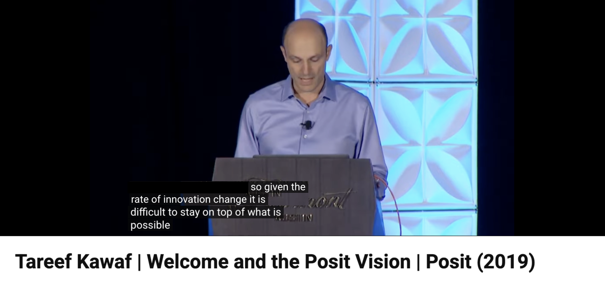

##

::: notes
Simon starts off with the fake story about the first time he listened to this test set episode.
:::

##

{.rounded}

::: notes
Becoming normal to spin up a coding agent, ask a question, and go with whatever the answer is. Sets a low bar for reproducibility, transparency, and correctness.
:::

##

:::notes
The prime directive is very important at Posit. (Screenshot of the many slack or confluence listings with this phrase? But they don't show a total count in the UI.) Maybe a reference to Star Trek (and a joke about how I didn't actually know that was a thing.) 
:::

# The Prime Directive

## The Prime Directive {.quote-slide}

> ::: {.fragment}
> _...those who receive the results of modern data analysis have limited opportunity to verify the results by direct observation._
> ::: 
>
> ::: {.fragment}
> _Users of the analysis have no option but to trust the analysis, and by extension the software that produced it._
> ::: 
> 
> ::: {.fragment}
> _Both the data analyst and the software provider therefore have a strong responsibility to produce a result that is trustworthy, and, if possible, one that can be_ shown _to be trustworthy._
> ::: 
>
> ::: {.fragment}
> _...This obligation I label the_ Prime Directive.
> ::: 

:::notes
re: the second-to-last point, this is "You don't have to trust me, here's how to reproduce it yourself."

https://books.google.com.mt/books?id=UXneuOIvhEAC&lpg=PP1&pg=PA1#v=onepage&q&f=false

Maybe this is when the screenshot lands? Or we make a nod to Tareef's rstudio::conf(2019) talk?
:::

:::footer
Software for Data Analysis: Programming with R, John Chambers (2008)
:::

##

. . .

  
{.rounded}

:::notes
This comes up internally a _lot_. Admittedly, many of those mentions are from our CEO.
:::

:::footer
:::

##

{.rounded}

:::footer
:::

:::notes
...he's been harping on the PD for a while
:::

##

{.rounded}

:::footer
As aside: we were overwhelmed by how fast things were changing even back then.
:::

##

{.rounded}

::: notes
Let's revisit this with the prime directive in mind...

"Both the data analyst and the software provider therefore have a strong responsibility to produce a result that is trustworthy, and, if possible, one that can be _shown_ to be trustworthy."

The code that models write often lives in a temp-file, and unless the user asks for it, is often not backed by an explicit registry of package versions. The chat transcripts from which they could be recovered are, by default, deleted after 30 or 60 days. And even with a reproducible analysis, the model might hallucinate findings, generalize findings beyond what the evidence actually shows, etc.
:::

##

> _"In the battle between convenience and correctness, convenience is winning"_ 
>
>     - A colleague

:::notes
This is one possible way to summarize this effect
:::

##

:::notes
Woah there buddy. Battle might be an overstatement.

Things were not perfect before. Why would Tareef have been speaking about the PD in 2019? Why would John Chambers have written about it in 2008?

Because the prime directive has always been under threat, and reproducibility has never been the norm.
:::

##

{.rounded}

:::footer
https://www.accountingweb.co.uk/business/management-accounting/convivialitys-spreadsheet-hell-sinks-the-business
:::

:::notes
Tareef might have had Conviviality in mind, which had been mistakely reporting healthy financials for years due to a "spreadsheet arithmetic error."

> '£5.2m of that £14m came thanks to “a material error in the financial forecasts”. The error, it later admitted, was “a spreadsheet arithmetic error”.'
:::

##

{.rounded}

:::notes
And, in 2008, John Chambers might have had Fannie Mae in mind, which discovered a $1.136 billion error in total shareholder equity:
> 'There were honest mistakes made in a spreadsheet used in the implementation of a new accounting standard.'

https://www.louisepryor.com/2004/01/10/fanniemae/
:::

:::footer
https://web.archive.org/web/20120917174753/https://www.pcworld.com/article/127189/article.html
:::

##

:::notes
So, the Prime Directive has always been under threat. That said, convenience and correctness cannot be in a _battle_ (in the same way that you cannot be in a battle with your VP lol).

The solution then, as it is now, it to make software that is both correct and also very convenient to use, both for the analyst and the end user of the analysis. This is the rationale behind our investment in OSS for R and Python, behind Shiny, behind Quarto, etc.

To publish a Shiny app, you click one button that says publish in your IDE and then reproducible R code, with package versions backed by renv, is hosted on Connect and available for your collaborators.
:::

##

{.rounded}

:::notes
Now, I promise this is the last time I'll show this screenshot.

With AI, a new technology means that the Prime Directive is under threat in a new way. 

How can we make software that is both correct _and_ convenient? Can we satisfy Chambers' Prime Directive while also making use of the leverage that these new tools provide?
:::

## Initial resolution: not a loop

## Posit Assistant

## Problem callback

## commons
