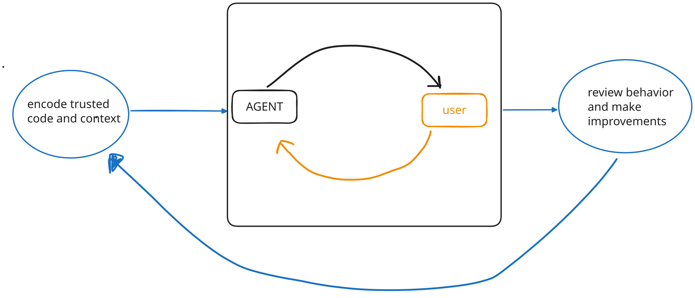

##

## {.agent-story-slide .slow-tool-calls}

```{=html}
<div class="agent-window">
  <div class="agent-thread">
        <div class="chat-turn chat-turn-user">
          <div class="chat-message chat-message-user">
            how is traffic trending for our site?
          </div>
        </div>
        <div class="chat-turn chat-turn-agent tool-run fragment fade-up" data-fragment-index="0">
          <div class="chat-message chat-message-agent">
            <div class="agent-thinking"><span></span> Analyzing site traffic</div>
            <div class="tool-card" style="--tool-delay: 0s">
              <span class="tool-card-icon">⌕</span>
              <span><strong>Searching workspace</strong><small>web analytics</small></span>
              <span class="tool-progress"><i class="tool-spinner"></i><i class="tool-check">✓</i></span>
            </div>
            <div class="tool-card" style="--tool-delay: 2.25s">
              <span class="tool-card-icon">◫</span>
              <span><strong>Querying warehouse</strong><small>analytics.pageviews</small></span>
              <span class="tool-progress"><i class="tool-spinner"></i><i class="tool-check">✓</i></span>
            </div>
            <div class="tool-card" style="--tool-delay: 3.5s">
              <span class="tool-card-icon">∿</span>
              <span><strong>Calculating daily visits</strong><small>last 90 days</small></span>
              <span class="tool-progress"><i class="tool-spinner"></i><i class="tool-check">✓</i></span>
            </div>
          </div>
        </div>
        <div class="chat-turn chat-turn-agent result-turn fragment fade-up" data-fragment-index="0">
          <div class="chat-message chat-message-agent">
            <p>Daily visits are down <strong>64%</strong> over the last 90 days.</p>
            <div class="dau-chart">
              <div class="dau-chart-title"><span>Daily site visits</span><strong>−64%</strong></div>
              <svg viewBox="0 0 620 225" role="img" aria-label="Daily site visits rise unevenly, then fall sharply after a changepoint.">
                <defs>
                  <linearGradient id="dau-area" x1="0" y1="0" x2="0" y2="1">
                    <stop offset="0%" stop-color="#ee6331" stop-opacity="0.28"/>
                    <stop offset="100%" stop-color="#ee6331" stop-opacity="0.02"/>
                  </linearGradient>
                </defs>
                <g class="chart-grid">
                  <line x1="56" y1="34" x2="598" y2="34"/><line x1="56" y1="86" x2="598" y2="86"/>
                  <line x1="56" y1="138" x2="598" y2="138"/><line x1="56" y1="190" x2="598" y2="190"/>
                </g>
                <g class="chart-labels">
                  <text x="46" y="39">60k</text><text x="46" y="91">40k</text><text x="46" y="143">20k</text>
                  <text x="56" y="215">90 days ago</text><text x="324" y="215">45 days ago</text><text x="598" y="215">Today</text>
                </g>
                <path class="chart-area" d="M56,61 L69,67 L82,58 L95,60 L108,54 L121,59 L134,51 L147,55 L160,57 L173,48 L186,52 L199,45 L212,50 L225,42 L238,46 L251,39 L264,44 L277,36 L290,41 L303,34 L313,37 L319,35 L329,51 L340,57 L351,53 L362,66 L373,61 L384,72 L395,78 L406,73 L417,86 L428,82 L439,95 L450,99 L461,93 L472,108 L483,103 L494,117 L505,113 L516,126 L527,122 L538,134 L549,130 L560,140 L571,137 L582,146 L598,145 L598,190 L56,190 Z"/>
                <path class="chart-line" pathLength="1" d="M56,61 L69,67 L82,58 L95,60 L108,54 L121,59 L134,51 L147,55 L160,57 L173,48 L186,52 L199,45 L212,50 L225,42 L238,46 L251,39 L264,44 L277,36 L290,41 L303,34 L313,37 L319,35 L329,51 L340,57 L351,53 L362,66 L373,61 L384,72 L395,78 L406,73 L417,86 L428,82 L439,95 L450,99 L461,93 L472,108 L483,103 L494,117 L505,113 L516,126 L527,122 L538,134 L549,130 L560,140 L571,137 L582,146 L598,145"/>
                <circle class="chart-end" cx="598" cy="145" r="6"/>
              </svg>
            </div>
          </div>
        </div>
  </div>
</div>
```

:::notes
This morning, your VP pulled up a coding agent and asked a question. 

Now, as data scientists, we might have asked ourselves "How are daily visits being measured?" "What event triggers an entry in this column?" "What other possible explanations could account for this change in trend?" If you had dug further, you would have learned that this kind of pageview event no longer triggers on newer versions of Chrome. As users gradually update Chrome, their page visits are no longer registered in this table, which is not the typical table used to measure site traffic anyway.

Nevertheless, you're not there. Your VP brings this chart to leadership. They decide to restructure the organization and spend millions to reverse the trend.
:::

## {.agent-story-slide .slow-tool-calls}

```{=html}
<div class="agent-window month-later-window">
  <div class="agent-thread">
    <div class="chat-turn chat-turn-user">
      <div class="chat-message chat-message-user">
        could you find the site traffic chart we made a month ago?
      </div>
    </div>
    <div class="chat-turn chat-turn-agent tool-run history-tool-run fragment fade-up" data-fragment-index="0">
      <div class="chat-message chat-message-agent">
        <div class="agent-thinking"><span></span> Looking for prior analysis</div>
        <div class="tool-card" style="--tool-delay: 0s">
          <span class="tool-card-icon">⌕</span>
          <span><strong>Searching conversations</strong><small>site traffic chart</small></span>
          <span class="tool-progress"><i class="tool-spinner"></i><i class="tool-check">✓</i></span>
        </div>
        <div class="tool-card" style="--tool-delay: 1.25s">
          <span class="tool-card-icon">◫</span>
          <span><strong>Checking generated files</strong><small>temporary workspace</small></span>
          <span class="tool-progress"><i class="tool-spinner"></i><i class="tool-check">✓</i></span>
        </div>
      </div>
    </div>
    <div class="chat-turn chat-turn-agent history-missing fragment fade-up" data-fragment-index="0">
      <div class="chat-message chat-message-agent">
        I couldn’t find that conversation or any saved analysis files. Do you want me to recreate that chart for the last 90 days?
      </div>
    </div>
    <div class="chat-turn chat-turn-user fragment fade-up" data-fragment-index="1">
      <div class="chat-message chat-message-user">
        yeah
      </div>
    </div>
    <div class="chat-turn chat-turn-agent tool-run fragment fade-up" data-fragment-index="2">
      <div class="chat-message chat-message-agent">
        <div class="agent-thinking"><span></span> Analyzing site traffic</div>
        <div class="tool-card" style="--tool-delay: 0s">
          <span class="tool-card-icon">⌕</span>
          <span><strong>Searching workspace</strong><small>web analytics</small></span>
          <span class="tool-progress"><i class="tool-spinner"></i><i class="tool-check">✓</i></span>
        </div>
        <div class="tool-card" style="--tool-delay: 1.25s">
          <span class="tool-card-icon">◫</span>
          <span><strong>Querying warehouse</strong><small>analytics.sessions</small></span>
          <span class="tool-progress"><i class="tool-spinner"></i><i class="tool-check">✓</i></span>
        </div>
        <div class="tool-card" style="--tool-delay: 2.5s">
          <span class="tool-card-icon">∿</span>
          <span><strong>Calculating daily visits</strong><small>last 90 days</small></span>
          <span class="tool-progress"><i class="tool-spinner"></i><i class="tool-check">✓</i></span>
        </div>
      </div>
    </div>
    <div class="chat-turn chat-turn-agent result-turn fragment fade-up" data-fragment-index="2">
      <div class="chat-message chat-message-agent">
        <p>Daily visits increased <strong>22%</strong> over the last 90 days.</p>
        <div class="dau-chart">
          <div class="dau-chart-title"><span>Daily site visits</span><strong>+22%</strong></div>
          <svg viewBox="0 0 620 225" role="img" aria-label="Daily site visits trend unevenly upward over the last 90 days.">
            <defs>
              <linearGradient id="traffic-area-up" x1="0" y1="0" x2="0" y2="1">
                <stop offset="0%" stop-color="#23875b" stop-opacity="0.26"/>
                <stop offset="100%" stop-color="#23875b" stop-opacity="0.02"/>
              </linearGradient>
            </defs>
            <g class="chart-grid">
              <line x1="56" y1="34" x2="598" y2="34"/><line x1="56" y1="86" x2="598" y2="86"/>
              <line x1="56" y1="138" x2="598" y2="138"/><line x1="56" y1="190" x2="598" y2="190"/>
            </g>
            <g class="chart-labels">
              <text x="46" y="39">60k</text><text x="46" y="91">40k</text><text x="46" y="143">20k</text>
              <text x="56" y="215">90 days ago</text><text x="324" y="215">45 days ago</text><text x="598" y="215">Today</text>
            </g>
            <path class="chart-area" d="M56,69 L69,74 L82,66 L95,71 L108,63 L121,68 L134,70 L147,61 L160,65 L173,57 L186,64 L199,60 L212,54 L225,58 L238,62 L251,52 L264,56 L277,48 L290,55 L303,51 L316,44 L329,50 L342,47 L355,39 L368,46 L381,43 L394,49 L407,40 L420,44 L433,36 L446,43 L459,38 L472,34 L485,42 L498,37 L511,31 L524,39 L537,35 L550,29 L563,36 L576,33 L589,38 L598,41 L598,190 L56,190 Z"/>
            <path class="chart-line" pathLength="1" d="M56,69 L69,74 L82,66 L95,71 L108,63 L121,68 L134,70 L147,61 L160,65 L173,57 L186,64 L199,60 L212,54 L225,58 L238,62 L251,52 L264,56 L277,48 L290,55 L303,51 L316,44 L329,50 L342,47 L355,39 L368,46 L381,43 L394,49 L407,40 L420,44 L433,36 L446,43 L459,38 L472,34 L485,42 L498,37 L511,31 L524,39 L537,35 L550,29 L563,36 L576,33 L589,38 L598,41"/>
            <circle class="chart-end" cx="598" cy="41" r="6"/>
          </svg>
        </div>
      </div>
    </div>
  </div>
</div>
```

:::notes
A month later, leadership asks to see the chart again. The VP opens up the same agent, but can't find the conversation. (It was deleted after 30 days.) All of the analysis had happened in a tempfile that is long gone. 

The agent offers to make it again. This time, when the VP asks for the same plot, they see that site visits had been steadily trending upward the whole time.
:::

##

<br><br><br>

::: {.quote}
_<span class="opening-quote">“</span>In the battle between convenience and correctness, convenience is winning”_
:::

::: {.attribution}
\- Joe Cheng
:::

::: notes
AI has largely been a threat to correctness. A broader population of people can now convincingly do data analysis.

It just so happened that Joe said this a month ago, but he could have said it a decade ago and it would still have been true.
:::

##

{.rounded}

:::footer
<span style="color:#ee6331;">https://www.accountingweb.co.uk/business/management-accounting/convivialitys-spreadsheet-hell-sinks-the-business</span>
:::

::: notes
In 2019, Conviviality (a beverage company) discovered they had been mistakenly reporting healthy financials for years due to a “spreadsheet arithmetic error.”

> £5.2m of that £14m came thanks to “a material error in the financial forecasts”. The error, it later admitted, was “a spreadsheet arithmetic error”.
:::

## 

. . .

{style="display: block; margin: 0 auto;"}

:::notes
There have always been threats to correctness in data analysis. This is why Posit was founded; correctness in high-stakes data analysis has always been our thing. But our stance was not "you need to forgo convenience in favor of correctess."
:::

##

<br><br>

::: {.quote}
_<span class="opening-quote">“</span>Our goal is to develop a powerful tool that supports trustworthy, high quality analysis._

_At the same time, we want RStudio to be as straightforward and intuitive as possible.”_
:::

::: {.attribution}
\- JJ Allaire, 2011
:::

:::footer
https://rstudioblog.wordpress.com/2011/02/28/rstudio-new-open-source-ide-for-r/
:::

:::notes
He's saying "it can be correct _and_ convenient."

With AI, our stance needs to be the same. How do we build data analysis agents that are both correct and convenient to use?
:::

# 

::: notes
this pull between correctness and convenience has weighed on all of our minds in this new age of llms

and it became especially relevant last year in 2025
for us and for many of you I imagine 2025 was the year AI got very very convenient and we needed to think seriously about correctness 

and we were so worried 
:::

# 

{.rounded height=500 style="top: 43%;"}

::: {style="position: absolute; top: 81%; width: 100%; font-size: 1.05em; text-align: center;"}
**August 2025**
:::

:::footer
<span style="color:#ee6331;">posit.co/blog/databot-is-not-a-flotation-device</span>
:::

::: notes
so worried that when we released our new sota coding agent in 2025, we did so under what was essentially a warning label

this is an image from a blog post joe and I wrote to accompany the release of databot, which was an exploratory data analysis agent that lived in positron

and this post was actually one of the first things I worked when I joined the AI team, and it gave me the opportunity to do one of the things that I think I do best: be a pessimist 
:::

# 

{style="display: block; margin: 0 auto;"}

:::footer
&lpar;2025&rpar;
:::

::: notes
because we were all so excited about databot, but also so worried about people trusting its answers when it was wrong

that we wrote an entire blog post explaining the ways in which it might fail
:::

# 

<br><br><br>

::: {.quote}
_<span class="opening-quote">“</span>In my 30-year career writing software professionally, Databot is both the most exciting software I’ve worked on, and also the most dangerous.”_
:::

::: {.attribution}
\- Joe Cheng
:::

::: notes
and if you were here at conf last year, you might remember Joe's keynote where said somethign a bit like this
:::


#

::: notes
and given that I think at this point there might be a question on your mind, which
I think is fair to ask and I think we all have asked ourselves in the past few years
:::

# Why are we doing this?!

::: notes
if AI is this agent of chaos that we are so worried, why involve ourselves at all
and there are many answers, one of which is that things really have changed since 2025. the model landscape shifts and things you might have worried about yesterday are no longr true today

but for me and I think many of us at posit, much of the answer has to do with a sense of curiosity and exploration
:::

## 

{.rounded}

::: notes
and I imagine for many of you, exploration and curiosity are what got you into this room in the first place

Maybe it was curiosity about a scientific field that led you to data analysis, or curiosity about the tools themselves, how computers work, or statistics.

For me, it was a little of all of those things. I have always been interested in many things at once. Data is great for that because there is data on everything -- US voting patterns, co2 levels on mauna kea, squirrels in central park 

But without the right tools, data can be impenetrable. As an undergraduate with knowledge of statistics and some R as an undergraduate, I felt like I was looking at an ocean from above.You know there is an incredible amount there, but you cannot see it. You have to know how to access it.

learning the tidyverse, and data science...these tools gave me a way to investigate any topic and learn about the world.
:::

## 

{.rounded}

::: notes
the right tools let us see below the surface
The tools enable the curiosity. 
:::

# AI is a continuation of this work

::: notes
Much has been said about LLMs as a paradigm shift in technology and in our lives. and maybe that's true.

But AI is also a continuation of work that Posit and this community have always done. We are curious about new tools: how they work, what they make possible, and we turn drive into tools that open up new worlds of analysis. 

Let's return to the VP who was vibe-analyzing earlier.

It would be easy to call what she was doing lazy or dismiss it as slop. But there is another way to look at it: she had meaningful questions that she wanted answered, and she reached for the tool that she thought would give her those answers.

That does not mean her answer was correct or that her process was trustworthy. But the curiosity was real.

I think we can meet she is with tools that make her work more correct and trustworthy, without shutting that curiosity down
:::


# 

# AI: untrustworthy, but useful?

::: notes
- Here’s a common thought about AI
  - It’s untrustworthy, but useful.
  <!-- Possible place to add bluffbench/bluffbench2 results. If we do that, also need a counter example of usefulness.-->
  - To make it trustworthy, we need people to verify the output from or supervise agents.
:::

# 

{width=80%}

::: notes
Human in the loop can mean many different things. for now we're just talking about a really simple version: a human is there to verify that what the agent does is correct and provide appropriate redirection if not.

it is an intuitively appealing division of labor. the agent does what it's good at, the human provides the judgment to keep it from going off the rails.
:::

## 

::: {style="display: flex; height: 100%; flex-direction: column; align-items: center; justify-content: center; gap: 0.75rem;"}
{style="width: auto; max-height: 540px; margin: 0; border-radius: 0.75rem;"}

<div class="fragment" style="min-height: 1.15em; margin: 0; font-size: 1.2em; line-height: 1.15;">*the <strong>slap a human on it</strong> approach</div>
:::

::: notes
and this sounds great, but it is not enough

but you can't stop there and assume that just because a human is present and technically "in the loop," you've solved the issue of correctness by asking them to verify something.

because this is not how people work--it's not how expertise works, and it's not how human decision-making works. you can't assume a human expert will automatically transfer expertise to an agent system just by being "in the loop."

and so I like to call this simplistic division of labor the "slap a human on it" approach.

and there's a lot of evidence that this won't work! but to convince you for now, I just want you to think about this:

when your coding agent (or past coding agents) shows you a command and asks you to approve it, how often do you carefully read that command, and how often do you just hit accept?
:::

# {background-image="figures/databot-flotation-beach.png" background-size="cover" background-position="center"}

::: {.fragment style="position: absolute; top: 43%; left: 2%; width: 45%; margin: 0; padding: 0.75rem 1rem; background: #fff; box-shadow: 0 0.5rem 1.25rem rgb(0 0 0 / 25%); font-size: 0.72em; font-weight: 300; text-align: left;"}
"Databot, and LLMs in general, aren’t at a point where you can abdicate responsibility or suspend skepticism when working with data. ...
These skills help you **catch errors, interpret results in context, and avoid being misled by confident but incorrect claims."**
:::

:::footer
<span style="color:#ee6331;">posit.co/blog/databot-is-not-a-flotation-device</span>
:::

::: notes
but this simple model is honestly pretty close to how we framed risk mitigation in Databot.

we wrote a whole article about the dangers of Databot and why we thought you shouldn't abandon your expertise, and essentially, why you needed to be vigilant.

we said you needed all the data skills you had to...

All of that is still true. I stand by it. It's inspirational! I would love to avoid being misled by confident but incorrect claims.

but i would not write this in this way today
notice that this puts the responsibility for correctness on the user: be there, remain vigilant, and apply your expertise.
:::

# ok, but how?

::: notes
But how, exactly, was the user supposed to apply that expertise?

our implicit strategy, not said outright but what we were all kind of thinking, was: we'll you've got to read the code.

but none of us did this, or at least we didn't do so in a way that would match the really alarming tone of that databot blog post (like i said i am a pessimist)

but even if we did I don't think thatthis setup is a good correctness strategy!

telling the user to be worried about the code produced relies too much on the hard work of the user, in an interface not conducive to reading (as code is streaming past them or being put into files faster than they could have imagined), but also because reading in that way is not a great way to form a mental model of a complex topic.

:::

# 

<div style="display: flex; height: 100%; flex-direction: column; justify-content: center; gap: 3rem; font-size: 1.2em; font-weight: 600; line-height: 1.15;">
<div>Telling people to be vigilant is not a correctness strategy.</div>
<div class="fragment">The presence of a human is not enough.</div>
</div>

::: notes
Just adding a human and telling them to remain vigilant and to be there is not a correctness strategy.

it relies too much on hard work on the part of the user, but also people are not a fixed safety component we can just slot into the loop. The agent, the interface, the timing and amount of information, cognitive load, and the cues the system provides all affect how someone makes a decision on whether a bit of code or an action is correct or safe. this is a complex system and the specifics of interaction determines whether and how your expertise is really being used.

and so I would not write the Databot post in the same way today. that does not mean human expertise is unnecessary. It's just that simply assigning the role of correctness monitor to the user does not make the system correct.
:::

# 

::: {.incremental}
* Build trust and correctness into the system itself
<br>
<br>
* Consider how interaction works with the user and can support their expertise
:::

::: notes
instead, today we are going talk about the new concrete approaches built into the systems themselves that push them towards correctness. first in posit assistant, databot's successor, and then in a new open source library

and specifically, encode correctness into the agent itself 
and design the interaction to support human expertise when the model will inevitably make mistakes. 
:::

# 

* Build trust and correctness into the system itself: **Help the agent be correct**
* Consider how interaction works with the user and can support their expertise: **Make it less bad when it's wrong**

::: notes
In other words: help the agent be correct, and make it less bad when it's wrong.
:::

# Posit Assistant

##

<video class="rounded click-to-toggle" width="100%" preload="auto" tabindex="0" aria-label="Click to play or pause">
  <source src="figures/posit-assistant-demo-p1.mov">
</video>

:::notes
Sara described her first moments of really wrapping her head around data science tools as like seeing below the surface. I think many of us might have had a moment like this at some point, when we began to understand how powerful data science and statistics are for answering questions about the world.

The first time I felt this way, I had been asked to use R to understand what affects flight delays. I had to load in some data and then write dplyr and ggplot to see if I could make any decisions that would give me better chances of my flight leaving on time. 

In demoing Posit Assistant, I thought I might revisit that moment with you. 

Posit Assistant is a coding and data science agent. It's available in RStudio, Positron, and the terminal. When it's running inside of your IDE, it works inside of your active R and Python session. You can use whatever model from whatever provider you want with it.

When playing the video:

* It can do normal coding agent stuff -- here, it uses web fetch to find information on the internet
* It uses the same functions you do to read documentation
* It prefers to keep data in the project
:::

##

<video class="rounded click-to-toggle" width="100%" preload="auto" tabindex="0" aria-label="Click to play or pause">
  <source src="figures/posit-assistant-demo-p2.mov">
</video>

:::notes
* Cleaning mode makes good use of your attention
* It pays attention to missing data, outliers, etc
* Cleaning script is persisted
* You can see plots
* The agent shows restraint in interpretation; is concerned about sample sizes before interpreting this anomoly in the plot
:::

##

{.rounded}

:::notes
We've designed Posit Assistant to be more correct, and we've designed it to make better use of your expertise than other coding agents, so that you're more likely to know when it's wrong.
:::

<!-- commons lead in --> 

# 

* Build trust and correctness into the system itself: **Help the agent be correct**
* Consider how interaction works with the user and can support their expertise: **Make it less bad when it's wrong**

# but what if the user is not a data scientist?

:::  notes
in post assistant, the user is typically a data or code minded person
this interface makes sense for them
::: 

# 

## {.agent-story-slide}

```{=html}
<div class="agent-window">
  <div class="agent-thread">
        <div class="chat-turn chat-turn-user">
          <div class="chat-message chat-message-user">
            how is traffic trending for our site?
          </div>
        </div>
        <div class="chat-turn chat-turn-agent tool-run fragment fade-up" data-fragment-index="0">
          <div class="chat-message chat-message-agent">
            <div class="agent-thinking"><span></span> Analyzing site traffic</div>
            <div class="tool-card" style="--tool-delay: 0s">
              <span class="tool-card-icon">⌕</span>
              <span><strong>Searching workspace</strong><small>web analytics</small></span>
              <span class="tool-progress"><i class="tool-spinner"></i><i class="tool-check">✓</i></span>
            </div>
            <div class="tool-card" style="--tool-delay: 1.05s">
              <span class="tool-card-icon">◫</span>
              <span><strong>Querying warehouse</strong><small>analytics.pageviews</small></span>
              <span class="tool-progress"><i class="tool-spinner"></i><i class="tool-check">✓</i></span>
            </div>
            <div class="tool-card" style="--tool-delay: 2.1s">
              <span class="tool-card-icon">∿</span>
              <span><strong>Calculating daily visits</strong><small>last 90 days</small></span>
              <span class="tool-progress"><i class="tool-spinner"></i><i class="tool-check">✓</i></span>
            </div>
          </div>
        </div>
        <div class="chat-turn chat-turn-agent result-turn fragment fade-up" data-fragment-index="0">
          <div class="chat-message chat-message-agent">
            <p>Daily visits are down <strong>64%</strong> over the last 90 days.</p>
            <div class="dau-chart">
              <div class="dau-chart-title"><span>Daily site visits</span><strong>−64%</strong></div>
              <svg viewBox="0 0 620 225" role="img" aria-label="Daily site visits rise unevenly, then fall sharply after a changepoint.">
                <defs>
                  <linearGradient id="dau-area" x1="0" y1="0" x2="0" y2="1">
                    <stop offset="0%" stop-color="#ee6331" stop-opacity="0.28"/>
                    <stop offset="100%" stop-color="#ee6331" stop-opacity="0.02"/>
                  </linearGradient>
                </defs>
                <g class="chart-grid">
                  <line x1="56" y1="34" x2="598" y2="34"/><line x1="56" y1="86" x2="598" y2="86"/>
                  <line x1="56" y1="138" x2="598" y2="138"/><line x1="56" y1="190" x2="598" y2="190"/>
                </g>
                <g class="chart-labels">
                  <text x="46" y="39">60k</text><text x="46" y="91">40k</text><text x="46" y="143">20k</text>
                  <text x="56" y="215">90 days ago</text><text x="324" y="215">45 days ago</text><text x="598" y="215">Today</text>
                </g>
                <path class="chart-area" d="M56,61 L69,67 L82,58 L95,60 L108,54 L121,59 L134,51 L147,55 L160,57 L173,48 L186,52 L199,45 L212,50 L225,42 L238,46 L251,39 L264,44 L277,36 L290,41 L303,34 L313,37 L319,35 L329,51 L340,57 L351,53 L362,66 L373,61 L384,72 L395,78 L406,73 L417,86 L428,82 L439,95 L450,99 L461,93 L472,108 L483,103 L494,117 L505,113 L516,126 L527,122 L538,134 L549,130 L560,140 L571,137 L582,146 L598,145 L598,190 L56,190 Z"/>
                <path class="chart-line" pathLength="1" d="M56,61 L69,67 L82,58 L95,60 L108,54 L121,59 L134,51 L147,55 L160,57 L173,48 L186,52 L199,45 L212,50 L225,42 L238,46 L251,39 L264,44 L277,36 L290,41 L303,34 L313,37 L319,35 L329,51 L340,57 L351,53 L362,66 L373,61 L384,72 L395,78 L406,73 L417,86 L428,82 L439,95 L450,99 L461,93 L472,108 L483,103 L494,117 L505,113 L516,126 L527,122 L538,134 L549,130 L560,140 L571,137 L582,146 L598,145"/>
                <circle class="chart-end" cx="598" cy="145" r="6"/>
              </svg>
            </div>
          </div>
        </div>
  </div>
</div>
```

::: notes

[show vp vibe analyzing again]
the vp is just a stand in
someone who has questions to ask of data, but isn't the data scientist, statician, analyst.

the lab PI, the medical director, a product manager, or even someone who is very technically capable but is working in an area not of their expertise
:::

# [_Trusted_ code]{style="color: #ee6331; font-size: 1.4em;"}

::: notes
in the story we told in the beginning
the data scientist knew something was wrong
they likely have code that they use to answer these kinds of questions, and that code might even live in quarto reports, packages, shiny apps, scripts

trusted code
leverage this instead of the model writing custom code each time
:::

# 

* Help the model not be wrong **by adding trusted code**
* Make it less bad when it is wrong 

# 

* Help the model not be wrong **by adding trusted code**
* Make it less bad when it is wrong **by signaling trust and setting up feedback loops**

::: notes
a second idea: signal how much to trust that code in a deterministic way and set up feedback loops to continually improve the correctness of the system
:::

# 

{width=80%}

::: notes
earlier I showed you this diagram
:::

# 

{width=80%}

::: notes
the system I'm proposing looks something like this
:::

# 

{width=80% style="display: block; margin: 0 auto;"}

# Trust flow diagram

# Trusted code and context

# Feedback loops
