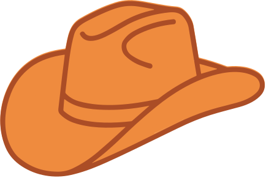

## {.title-slide .green-slide}

::: {.columns}

::: {.column width="68%"}
### Agents for correct, transparent, and reproducible analysis {.talk-title}

::: {.talk-meta}
**Sara Altman and Simon Couch**

posit::conf(2026)
:::
:::

::: {.column width="32%"}

  
  

:::

:::

## {.quote-slide .paper-slide}

> "In the battle between convenience and correctness, convenience is winning."
>
> <footer>Joe Cheng, Posit CTO</footer>

## {.statement-slide .paper-slide}

::: {.statement}
Correctness can be [convenient.]{.accent}
:::

## {.header-slide .blue-slide}

::: {.columns}

::: {.column .header-text width="64%"}
Your VP is doing  
rogue analysis  
in Cursor
:::

::: {.column width="36%"}
{.header-image fig-alt="Orange cowboy hat"}
:::

:::

## {.statement-slide .paper-slide}

::: {.statement}
Telling people to be vigilant is [not a correctness strategy.]{.accent}
:::

## {.split-image-slide .paper-slide}

::: {.columns}

::: {.column width="50%"}
### AI is a continuation of this work {.split-title}
:::

::: {.column width="50%"}
{fig-alt="Aerial view of the ocean"}
:::

:::

## {.image-caption-slide background-image="figures/erick-morales-oyola-sSfE0Z_TuSw-unsplash.jpg" background-size="cover" background-position="center"}

::: {.image-caption}
### Curiosity is what got us into this room. {.image-caption-title}
:::

## {.header-slide .blue-slide}

::: {.columns}

::: {.column .header-text width="65%"}
Correctness vs.  
convenience
:::

::: {.column width="35%"}
{.header-image fig-alt="Commons logo"}
:::

:::

## {.statement-slide .paper-slide}

::: {.statement}
Help the agent be [correct.]{.accent}  
Make it less bad when it's wrong.
:::

## {.palette-slide}

::: {.palette-heading}
[Complete palette]{.eyebrow}

### Reference colors + slide colors {.palette-title}

A focused system built around the reference navy and pink with the established slide colors.
:::

  
<strong>Reference navy</strong>#24437B

  
<strong>Pink</strong>#F7C9D5

  
<strong>Cool paper</strong>#F5F2EC

  
<strong>Ink</strong>#15243A

  
<strong>Slide green</strong>#3A6945

  
<strong>Periwinkle</strong>#8393CF

  
<strong>Warm cream</strong>#FFF1C9

